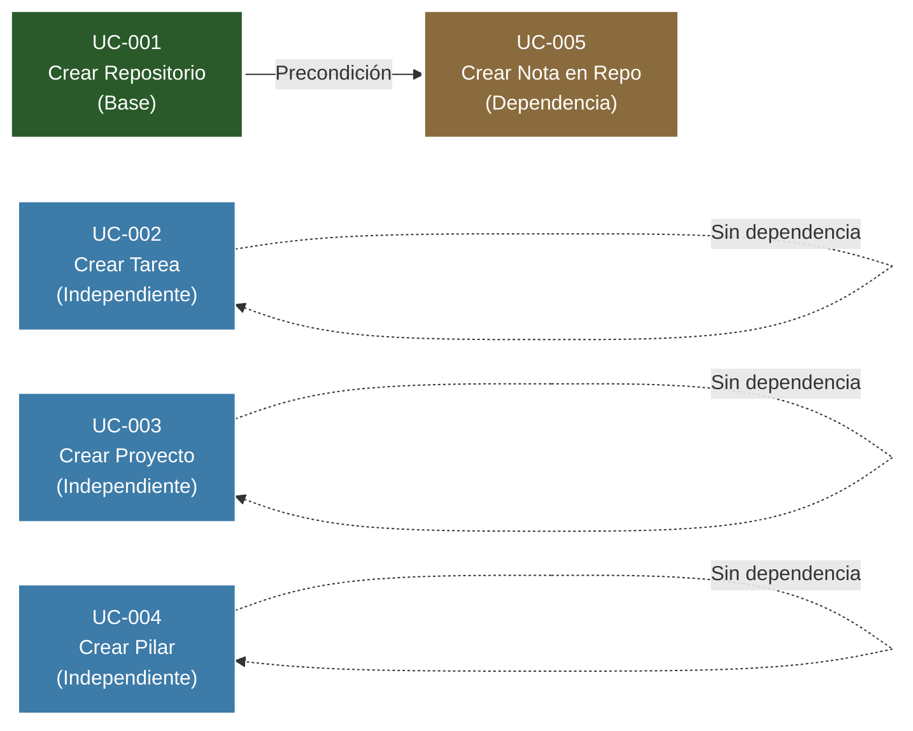
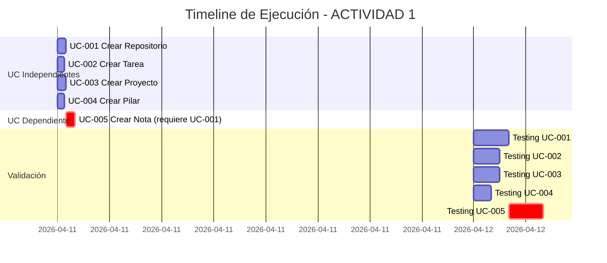
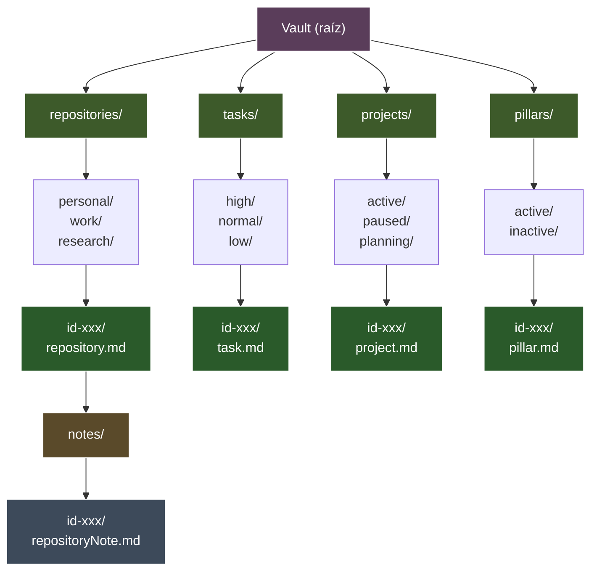

```mermaid
graph TB
    Usuario["👤 Usuario (Nestor)"]
    QuickAdd["⚙️ QuickAdd Plugin"]
    Obsidian["📁 Obsidian Core"]
    Utils["🔧 Módulos Utils/"]
    Template["📝 Template Engine"]
    MetadataCache["💾 MetadataCache"]
    
    UC001["UC-001: Crear Repositorio"]
    UC002["UC-002: Crear Tarea"]
    UC003["UC-003: Crear Proyecto"]
    UC004["UC-004: Crear Pilar"]
    UC005["UC-005: Crear Nota en Repo"]
    
    Usuario -->|Invoca| UC001
    Usuario -->|Invoca| UC002
    Usuario -->|Invoca| UC003
    Usuario -->|Invoca| UC004
    Usuario -->|Invoca| UC005
    
    QuickAdd -->|Orquesta| UC001
    QuickAdd -->|Orquesta| UC002
    QuickAdd -->|Orquesta| UC003
    QuickAdd -->|Orquesta| UC004
    QuickAdd -->|Orquesta| UC005
    
    Obsidian -->|Crea estructura| UC001
    Obsidian -->|Crea estructura| UC002
    Obsidian -->|Crea estructura| UC003
    Obsidian -->|Crea estructura| UC004
    Obsidian -->|Crea estructura| UC005
    
    Utils -->|Valida, genera| UC001
    Utils -->|Valida, genera| UC002
    Utils -->|Valida, genera| UC003
    Utils -->|Valida, genera| UC004
    Utils -->|Valida, genera| UC005
    
    Template -->|Genera contenido| UC001
    Template -->|Genera contenido| UC002
    Template -->|Genera contenido| UC003
    Template -->|Genera contenido| UC004
    Template -->|Genera contenido| UC005
    
    MetadataCache -->|Lee metadata| UC005
    
    style Usuario fill:#4a7c8f,stroke:#fff,color:#fff
    style QuickAdd fill:#2d5a7b,stroke:#fff,color:#fff
    style Obsidian fill:#5a3d2a,stroke:#fff,color:#fff
    style Utils fill:#3d5a2a,stroke:#fff,color:#fff
    style Template fill:#5a3d5a,stroke:#fff,color:#fff
    style MetadataCache fill:#5a5a3d,stroke:#fff,color:#fff
    
    style UC001 fill:#3d7ba8,stroke:#fff,color:#fff
    style UC002 fill:#3d7ba8,stroke:#fff,color:#fff
    style UC003 fill:#3d7ba8,stroke:#fff,color:#fff
    style UC004 fill:#3d7ba8,stroke:#fff,color:#fff
    style UC005 fill:#3d7ba8,stroke:#fff,color:#fff
```

```mermaid
graph TB
    OP001["OP-001: Obtener Entrada"]
    OP002["OP-002: Validar Entrada"]
    OP003["OP-003: Gen ID Único"]
    OP005["OP-005: Obtener Fecha"]
    OP006["OP-006: Nombre Archivo"]
    OP007["OP-007: Obtener Metadata"]
    OP008["OP-008: Carpeta Padre"]
    OP010["OP-010: Estructura Carpetas"]
    OP011["OP-011: Procesar Específico"]
    OP012["OP-012: Asignar Variables"]
    OP013["OP-013: Ejecutar Template"]
    OP014["OP-014: Crear Archivo"]
    OP015["OP-015: Notificación"]
    
    UC001["UC-001"]
    UC002["UC-002"]
    UC003["UC-003"]
    UC004["UC-004"]
    UC005["UC-005"]
    
    OP001 --> UC001 & UC002 & UC003 & UC004 & UC005
    OP002 --> UC001 & UC002 & UC003 & UC004 & UC005
    OP003 --> UC001 & UC002 & UC003 & UC004 & UC005
    OP005 --> UC001 & UC002 & UC003 & UC004 & UC005
    OP006 --> UC001 & UC002 & UC003 & UC004 & UC005
    OP007 --> UC002 & UC003 & UC005
    OP008 --> UC001 & UC003 & UC004
    OP010 --> UC001 & UC003 & UC004
    OP011 --> UC001 & UC002 & UC003 & UC004 & UC005
    OP012 --> UC001 & UC002 & UC003 & UC004 & UC005
    OP013 --> UC001 & UC002 & UC003 & UC004 & UC005
    OP014 --> UC001 & UC002 & UC003 & UC004 & UC005
    OP015 --> UC001 & UC002 & UC003 & UC004 & UC005
    
    style OP001 fill:#2a5a2a,stroke:#fff,color:#fff,stroke-width:2px
    style OP002 fill:#2a5a2a,stroke:#fff,color:#fff,stroke-width:2px
    style OP003 fill:#2a5a2a,stroke:#fff,color:#fff,stroke-width:2px
    style OP005 fill:#2a5a2a,stroke:#fff,color:#fff,stroke-width:2px
    style OP006 fill:#2a5a2a,stroke:#fff,color:#fff,stroke-width:2px
    style OP012 fill:#2a5a2a,stroke:#fff,color:#fff,stroke-width:2px
    style OP013 fill:#2a5a2a,stroke:#fff,color:#fff,stroke-width:2px
    style OP014 fill:#2a5a2a,stroke:#fff,color:#fff,stroke-width:2px
    style OP015 fill:#2a5a2a,stroke:#fff,color:#fff,stroke-width:2px
    style OP007 fill:#5a5a2a,stroke:#fff,color:#fff
    style OP008 fill:#5a5a2a,stroke:#fff,color:#fff
    style OP010 fill:#5a5a2a,stroke:#fff,color:#fff
    style OP011 fill:#5a5a2a,stroke:#fff,color:#fff
    
    style UC001 fill:#3d7ba8,stroke:#fff,color:#fff
    style UC002 fill:#3d7ba8,stroke:#fff,color:#fff
    style UC003 fill:#3d7ba8,stroke:#fff,color:#fff
    style UC004 fill:#3d7ba8,stroke:#fff,color:#fff
    style UC005 fill:#3d7ba8,stroke:#fff,color:#fff
```

```yaml
type: Documento Técnico
title: PASO 3 - DIAGRAMAS DE ACTORES
version: 1.0.0
scope: ACTIVIDAD 1 - Visualizaciones de relaciones
date: 2026-04-11
language: Español Mexicano - Técnico Profesional
status: Diagramas Mermaid completos
```

# PASO 3: DIAGRAMAS DE ACTORES
## Visualizaciones de Relaciones Actor↔UC y Dependencias

---

## INTRODUCCIÓN

Este artefacto proporciona **4 diagramas Mermaid** que visualizan:

1. **Diagrama 1**: Relación Actor → UC (quién participa en qué)
2. **Diagrama 2**: Flujo de datos entre actores
3. **Diagrama 3**: Dependencias entre UCs
4. **Diagrama 4**: Timeline de ejecución

Los diagramas complementan la matriz textual de ARTEFACTO 2.

---

## DIAGRAMA 1: RELACIÓN ACTOR → UC

### Descripción
Muestra qué actores participan en cada UC. Cada nodo UC se conecta a los actores que intervienen.

### Visualización Mermaid



### Interpretación
- **Líneas sólidas**: Participación obligatoria en UC
- **Color de Actor**: Tipo de actor (Usuario, Sistema, Componente)
- **Convergencia**: UC-005 tiene 6 actores (extra: MetadataCache)

---

## DIAGRAMA 2: FLUJO DE DATOS ENTRE ACTORES

### Descripción
Muestra cómo fluyen los datos entre actores durante la ejecución de un UC típico (UC-001).

### Visualización Mermaid

```mermaid
sequenceDiagram
    participant U as Usuario
    participant Q as QuickAdd
    participant Utils as Utils/
    participant T as Template
    participant O as Obsidian
    participant FS as File System

    U->>Q: 1. Invoca macro "Crear Repositorio"
    Q->>U: 2. Muestra prompt "Nombre repositorio"
    U->>Q: 3. Ingresa "Mi Proyecto" + selecciona "Work"
    
    Q->>Utils: 4. validateCommonInput(input)
    Utils->>Q: 5. Retorna: válido ✓
    
    Q->>Utils: 6. generateUniqueId()
    Utils->>Q: 7. Retorna: id-naq5a4-...
    
    Q->>Utils: 8. getCurrentDateTime()
    Utils->>Q: 9. Retorna: 2026-04-11T14:30:45Z
    
    Q->>Utils: 10. getFileName("Mi Proyecto")
    Utils->>Q: 11. Retorna: mi-proyecto.md
    
    Q->>Utils: 12. getGrandParentFolder()
    Utils->>Q: 13. Retorna: 400-DIARIO
    
    Q->>Q: 14. Asigna variables (OP-012)
    Q->>T: 15. Paso variables al template
    T->>Q: 16. Retorna: contenido markdown final
    
    Q->>O: 17. createFolder(repositories/work/id-naq5a4)
    O->>FS: 18. Crea carpetas recursivamente
    FS->>O: 19. Éxito
    
    Q->>O: 20. create(mi-proyecto.md, contenido)
    O->>FS: 21. Escribe archivo
    FS->>O: 22. Archivo creado
    
    Q->>Utils: 23. showNotification("Éxito")
    Utils->>U: 24. Muestra notificación verde
    U->>U: 25. Ve "Repositorio creado"
    
    style U fill:#4a7c8f,stroke:#fff,color:#fff
    style Q fill:#2d5a7b,stroke:#fff,color:#fff
    style Utils fill:#3d5a2a,stroke:#fff,color:#fff
    style T fill:#5a3d5a,stroke:#fff,color:#fff
    style O fill:#5a3d2a,stroke:#fff,color:#fff
    style FS fill:#3d3d3d,stroke:#fff,color:#fff
```

### Interpretación
- **Actor a Actor**: Paso de datos entre componentes
- **Numeración 1-25**: Secuencia de pasos en UC-001
- **Pasos 4-13**: Core operations (Utils)
- **Pasos 14-16**: Template execution
- **Pasos 17-22**: File system creation
- **Pasos 23-25**: Feedback al usuario

---

## DIAGRAMA 3: DEPENDENCIAS ENTRE UCS

### Descripción
Muestra qué UCs dependen de otros. Solo UC-005 tiene una precondición (UC-001).

### Visualización Mermaid



### Interpretación
- **Flecha sólida**: Dependencia real (UC-001 → UC-005)
- **Línea punteada**: Independencia (UCs 2, 3, 4)
- **Color verde**: UC base (UC-001)
- **Color naranja**: UC dependiente (UC-005)
- **Color azul**: UCs independientes (UC-002, 003, 004)

### Testing Order Implicado
1. **Paralelo**: UC-001, UC-002, UC-003, UC-004
2. **Después**: UC-005 (requiere UC-001)

---

## DIAGRAMA 4: OPERACIONES ATÓMICAS REUTILIZADAS

### Descripción
Muestra qué operaciones atómicas (OP-001 a OP-015) se reutilizan en cada UC.

### Visualización Mermaid



### Interpretación
- **Verde oscuro**: OP reutilizadas en TODOS los 5 UCs (9 operaciones)
- **Verde oliva**: OP reutilizadas en 3-4 UCs (4 operaciones)
- **Azul**: UCs que usan estas operaciones

### Análisis
**OP Core (reutilizadas en 5/5 UCs):**
- OP-001, OP-002, OP-003, OP-005, OP-006, OP-011, OP-012, OP-013, OP-014, OP-015 (10 operaciones)

**OP Selectivas (reutilizadas en 3-4 UCs):**
- OP-007 (3 UCs: UC-002, UC-003, UC-005)
- OP-008 (3 UCs: UC-001, UC-003, UC-004)
- OP-010 (3 UCs: UC-001, UC-003, UC-004)
- OP-011 (5 UCs: todas)

---

## DIAGRAMA 5: TIMELINE DE EJECUCIÓN

### Descripción
Muestra el tiempo relativo de ejecución de cada UC, asumiendo que se ejecutan en paralelo donde es posible.

### Visualización Mermaid



### Interpretación
- **UCs 1-4**: Se pueden ejecutar en paralelo (0:00 - 0:30)
- **UC-5**: Debe ejecutarse DESPUÉS de UC-001 (0:30 - 1:00)
- **Testing UC-5**: Depende de que UC-001 esté testeado primero

**Parallelismo:**
- Máximo nivel de paralelismo: 4 UCs simultáneamente (UC-001 a UC-004)
- Después: 1 UC secuencial (UC-005)

---

## DIAGRAMA 6: MATRIZ DE COMPLEJIDAD

### Descripción
Muestra la complejidad relativa de cada UC (complejidad vs número de actores).

### Visualización Mermaid

```mermaid
scatter
    title Matriz de Complejidad - UCs vs Actores
    x-axis "Número de Actores Involucrados"
    y-axis "Complejidad Estimada"
    
    point [5, 2] -> UC-001
    point [5, 2] -> UC-002
    point [5, 2] -> UC-003
    point [5, 2] -> UC-004
    point [6, 3] -> UC-005
```

### Tabla Equivalente

| UC | Actores | Complejidad | Razón |
|----|---------|---|---|
| UC-001 | 5 | MEDIA | 12 operaciones |
| UC-002 | 5 | MEDIA | 11 operaciones |
| UC-003 | 5 | MEDIA | 13 operaciones |
| UC-004 | 5 | MEDIA | 10 operaciones |
| UC-005 | 6 | ALTA | 11 operaciones + precondición + metadata |

### Interpretación
- **UC-005 es única**: 6 actores (incluye MetadataCache)
- **UC-005 es más compleja**: ALTA (vs MEDIA en otros)
- **Todas comparten**: 5 actores core (Usuario, QuickAdd, Obsidian, Utils, Template)

---

## DIAGRAMA 7: ESTRUCTURA DE CARPETAS (Vista Jerárquica)

### Descripción
Muestra la estructura de carpetas que cada UC crea en el vault.

### Visualización Mermaid



### Interpretación
- **Nivel 1**: Carpetas principales (repositories, tasks, projects, pillars)
- **Nivel 2**: Subcarpetas por tipo/estado/prioridad
- **Nivel 3**: ID único para cada entidad
- **UC-005 especial**: Crea carpeta `notes/` dentro del repositorio

---

## RESUMEN: DIAGRAMAS CLAVE

| Diagrama | Propósito | Insight Clave |
|----------|-----------|---|
| **Diagrama 1** | Actor → UC | 6 actores, 5 UCs, 26 interacciones |
| **Diagrama 2** | Flujo de datos | 25 pasos secuenciales en UC-001 |
| **Diagrama 3** | Dependencias | UC-005 requiere UC-001 |
| **Diagrama 4** | Operaciones | 10 OPs reutilizadas en todos los UCs |
| **Diagrama 5** | Timeline | 4 UCs paralelos, 1 UC secuencial |
| **Diagrama 6** | Complejidad | UC-005 es más complejo (6 actores, ALTA) |
| **Diagrama 7** | Estructura | 4 árboles principales + 1 subarbol (notes/) |

---

## CONCLUSIÓN

Los diagramas visualizan:
1. **Participación**: Cada actor en cada UC
2. **Flujo**: Cómo fluyen los datos entre componentes
3. **Dependencias**: Qué UCs dependen de otros
4. **Reutilización**: Qué operaciones se reutilizan
5. **Paralelismo**: Qué UCs pueden ejecutarse simultáneamente
6. **Complejidad**: Relative difficulty de cada UC
7. **Estructura**: Cómo se organiza el vault post-ejecución

---

**DOCUMENTO**: PASO3-DIAGRAMA-ACTORES.md
**VERSIÓN**: 1.0.0
**FECHA**: 2026-04-11
**ESTADO**: DIAGRAMAS COMPLETADOS - VISUALIZACIONES LISTAS
