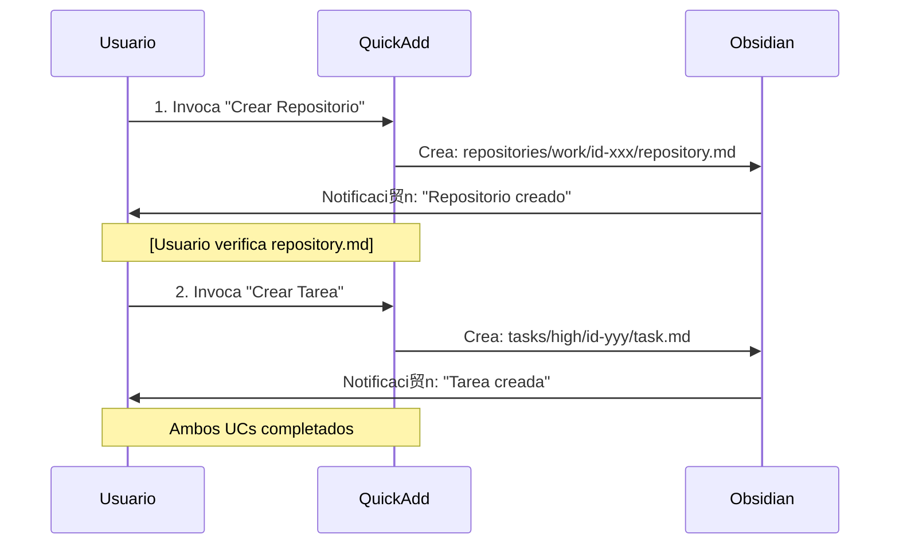
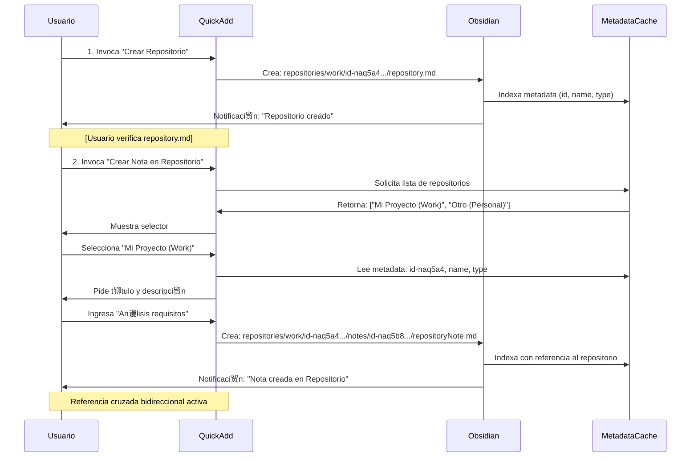
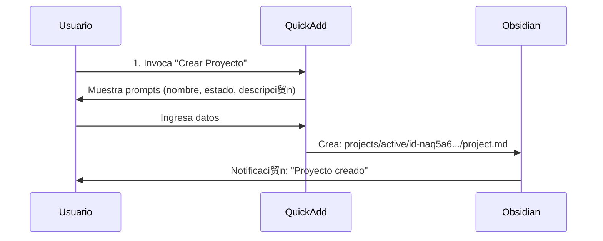

```yaml
type: Documento T茅cnico
title: PASO 3 - FLUJOS DE SECUENCIA
version: 1.0.0
scope: ACTIVIDAD 1 - Flujos de datos entre UCs
date: 2026-04-11
language: Espa帽ol Mexicano - T茅cnico Profesional
status: An谩lisis de flujos y secuencias
```

# PASO 3: FLUJOS DE SECUENCIA
## Documentaci贸n de Flujos de Datos entre UCs

---

## INTRODUCCI�[SPEC]N

Este artefacto documenta **5 flujos principales** que muestra c贸mo los UCs se conectan y c贸mo fluyen los datos entre ellos:

1. **Flujo 1**: UC-001 UC-002 (Crear repositorio, luego crear tarea)
2. **Flujo 2**: UC-001 UC-005 (Crear repositorio, luego crear nota dentro)
3. **Flujo 3**: UC-004 (Independiente: crear pilar)
4. **Flujo 4**: UC-003 (Independiente: crear proyecto)
5. **Flujo 5**: Flujo completo (todos los UCs en secuencia)

Cada flujo incluye diagrama, an谩lisis de dependencias y consideraciones de implementaci贸n.

---

## FLUJO 1: UC-001 UC-002
### Crear Repositorio, Luego Crear Tarea

### Prop贸sito
El usuario crea un repositorio y luego una tarea asociada. La tarea puede ser contexto del repositorio o independiente.

### Precondiciones
- UC-001 completado exitosamente

### Pasos del Flujo

```
1. Usuario invoca UC-001 (Crear Repositorio)
   [DONE]��[DONE]�[READY] Ingresa nombre, tipo
   [DONE]��[DONE]�[READY] Sistema crea: repositories/work/id-naq5a4.../repository.md
   [DONE]��[DONE]�[READY] Usuario ve notificaci贸n de 茅xito

2. Usuario invoca UC-002 (Crear Tarea)
   [DONE]��[DONE]�[READY] Ingresa t铆tulo, prioridad, fecha
   [DONE]��[DONE]�[READY] Sistema crea: tasks/high/id-naq5a5.../task.md
   [DONE]��[DONE]�[READY] Usuario ve notificaci贸n de 茅xito

3. Resultado final
   [DONE]��[DONE]�[READY] Vault contiene:
      [DONE]�[DONE][DONE]�[READY] repositories/work/id-naq5a4.../repository.md
      [DONE]��[DONE]�[READY] tasks/high/id-naq5a5.../task.md
```

### Diagrama de Secuencia



### An谩lisis de Datos

| Elemento | UC-001 | UC-002 | Conexi贸n |
|----------|--------|--------|----------|
| Vault State | Inicial | repositories/work/id-xxx/ | Acumula estructura |
| Archivos creados | 1 | +1 = 2 total | Sin sobreescritura |
| IDs 煤nicos | id-naq5a4 | id-naq5a5 | No colisionan |
| Metadata | Timestamps | Timestamps | Independientes |

### Consideraciones de Implementaci贸n

- **Independencia**: UC-002 NO depende de UC-001 (crear tarea sin repositorio es v谩lido)
- **Contexto**: Usuario puede vincular tarea al repositorio manualmente en templates
- **Timing**: Pueden ejecutarse inmediatamente sin esperar
- **Riesgo**: BAJO - sin precondiciones

---

## FLUJO 2: UC-001 UC-005
### Crear Repositorio, Luego Crear Nota en Repositorio

### Prop贸sito
El usuario crea un repositorio y luego una nota dentro de ese repositorio. UC-005 depende de UC-001.

### Precondiciones
- UC-001 completado exitosamente
- Usuario conoce el ID o nombre del repositorio creado

### Pasos del Flujo

```
1. Usuario invoca UC-001 (Crear Repositorio)
   [DONE]��[DONE]�[READY] Ingresa nombre: "Mi Proyecto", tipo: "Work"
   [DONE]��[DONE]�[READY] Sistema crea:
      [DONE]�[DONE][DONE]�[READY] repositories/work/id-naq5a4.../repository.md
      [DONE]��[DONE]�[READY] Metadata en frontmatter: id=id-naq5a4
   [DONE]��[DONE]�[READY] Usuario ve notificaci贸n de 茅xito

2. Usuario invoca UC-005 (Crear Nota en Repositorio)
   [DONE]��[DONE]�[READY] Sistema lista repositorios existentes
   [DONE]��[DONE]�[READY] Usuario selecciona "Mi Proyecto (Work)"
   [DONE]��[DONE]�[READY] Sistema lee metadata: id=id-naq5a4
   [DONE]��[DONE]�[READY] Usuario ingresa t铆tulo: "An谩lisis requisitos"
   [DONE]��[DONE]�[READY] Sistema crea: repositories/work/id-naq5a4.../notes/id-naq5b8.../repositoryNote.md
   [DONE]��[DONE]�[READY] Frontmatter incluye: repositoryId=id-naq5a4, repositoryName="Mi Proyecto"
   [DONE]��[DONE]�[READY] Usuario ve notificaci贸n de 茅xito

3. Resultado final
   [DONE]��[DONE]�[READY] Vault contiene:
      [DONE]�[DONE][DONE]�[READY] repositories/work/id-naq5a4.../
      [DONE]��  [DONE]�[DONE][DONE]�[READY] repository.md (padre)
      [DONE]��  [DONE]��[DONE]�[READY] notes/id-naq5b8.../repositoryNote.md (hijo)
      [DONE]��[DONE]�[READY] Referencia cruzada: [[Mi Proyecto]]
```

### Diagrama de Secuencia



### An谩lisis de Datos

| Elemento | UC-001 | UC-005 | Conexi贸n |
|----------|--------|--------|----------|
| Vault State | Inicial | repositories/work/id-xxx/notes/ | Estructura jer谩rquica |
| Archivos creados | 1 | +1 dentro = 2 total en repo | Contenido anidado |
| IDs 煤nicos | id-naq5a4 | id-naq5b8 | No colisionan |
| Metadata | name, type | repositoryId, repositoryName | Vinculaci贸n expl铆cita |
| Referencia Cruzada | - | [[Mi Proyecto]] | Bidireccional |

### Consideraciones de Implementaci贸n

- **Precondici贸n CR��TICA**: UC-001 debe estar completado
- **MetadataCache**: Esencial para listar repositorios
- **Validaci贸n**: Si repositorio no existe Error E-001
- **Timing**: UC-005 debe ejecutarse DESPU��S de UC-001
- **Riesgo**: MEDIO - depende de integridad de metadata

### Testing Order
1. Primero: Test UC-001 completamente
2. Luego: Test UC-005 con repositorio existente
3. Finalmente: Test secuencia completa

---

## FLUJO 3: UC-004 (INDEPENDIENTE)
### Crear Pilar

### Prop贸sito
El usuario crea un pilar (谩rea tem谩tica fundamental). UC-004 es completamente independiente.

### Precondiciones
- Ninguna

### Pasos del Flujo

```
1. Usuario invoca UC-004 (Crear Pilar)
   [DONE]��[DONE]�[READY] Ingresa nombre: "Arquitectura Software", estado: "Active"
   [DONE]��[DONE]�[READY] Sistema crea: pillars/active/id-naq5a7.../pillar.md
   [DONE]��[DONE]�[READY] Usuario ve notificaci贸n de 茅xito

2. Resultado final
   [DONE]��[DONE]�[READY] Vault contiene:
      [DONE]��[DONE]�[READY] pillars/active/id-naq5a7.../pillar.md
      [DONE]��[DONE]�[READY] Sin dependencias de otros UCs
      [DONE]��[DONE]�[READY] Sin archivos relacionados autom谩ticamente
```

### Diagrama de Secuencia


### An谩lisis de Datos

| Elemento | UC-004 |
|----------|--------|
| Precondici贸n | Ninguna |
| Estructura | pillars/active/id-xxx/ |
| Archivos | 1 (pillar.md) |
| IDs | id-naq5a7 |
| Independencia | Total (no depende de otros UCs) |

### Consideraciones de Implementaci贸n

- **Simplicidad**: M谩s simple que UC-001, UC-002, UC-003
- **Independencia**: Puede ejecutarse en cualquier momento
- **Paralelismo**: Puede ejecutarse simult谩neamente con UC-001, UC-002, UC-003, UC-005
- **Riesgo**: BAJO - sin precondiciones

---

## FLUJO 4: UC-003 (INDEPENDIENTE)
### Crear Proyecto

### Prop贸sito
El usuario crea un proyecto. UC-003 es completamente independiente.

### Precondiciones
- Ninguna

### Pasos del Flujo

```
1. Usuario invoca UC-003 (Crear Proyecto)
   [DONE]��[DONE]�[READY] Ingresa nombre: "Implementar autenticaci贸n", estado: "Active"
   [DONE]��[DONE]�[READY] Ingresa descripci贸n: "Sistema OAuth2 + 2FA"
   [DONE]��[DONE]�[READY] Sistema crea: projects/active/id-naq5a6.../project.md
   [DONE]��[DONE]�[READY] Usuario ve notificaci贸n de 茅xito

2. Resultado final
   [DONE]��[DONE]�[READY] Vault contiene:
      [DONE]��[DONE]�[READY] projects/active/id-naq5a6.../project.md
      [DONE]��[DONE]�[READY] Sin dependencias
```

### Diagrama de Secuencia



### An谩lisis de Datos

| Elemento | UC-003 |
|----------|--------|
| Estructura | projects/active/id-xxx/ |
| Archivos | 1 (project.md) |
| IDs | id-naq5a6 |
| Independencia | Total |

### Consideraciones de Implementaci贸n

- **Complejidad**: Similar a UC-001 (17 pasos)
- **Independencia**: No depende de otros UCs
- **Paralelismo**: Compatible con todos los dem谩s
- **Riesgo**: BAJO

---

## FLUJO 5: FLUJO COMPLETO
### Todos los UCs en Secuencia L贸gica

### Prop贸sito
El usuario ejecuta todos los UCs en el orden que tiene m谩s sentido l贸gico, aprovechando dependencias donde existen.

### Orden Recomendado

```
PARALELO (T=0:00 a 0:30)
[DONE]�[DONE][DONE]�[READY] UC-001: Crear Repositorio (30 min)
[DONE]�[DONE][DONE]�[READY] UC-002: Crear Tarea (25 min)
[DONE]�[DONE][DONE]�[READY] UC-003: Crear Proyecto (30 min)
[DONE]��[DONE]�[READY] UC-004: Crear Pilar (25 min)

SECUENCIAL (T=0:30 a 1:00)
[DONE]��[DONE]�[READY] UC-005: Crear Nota en Repositorio (30 min)
   (Requiere UC-001 completado)

RESULTADO FINAL (T=1:00)
[DONE]��[DONE]�[READY] Vault contiene todos los elementos creados
```

### Diagrama de Gantt

```mermaid
gantt
    title Flujo Completo ACTIVIDAD 1 - Timeline Paralelo + Secuencial
    dateFormat HH:mm
    
    section UC Paralelos (0:00-0:30)
    UC-001 Repositorio :uc001, 00:00, 30m
    UC-002 Tarea :uc002, 00:00, 25m
    UC-003 Proyecto :uc003, 00:00, 30m
    UC-004 Pilar :uc004, 00:00, 25m
    
    section UC Secuencial (Despu茅s de 0:30)
    UC-005 Nota en Repo :crit, uc005, after uc001, 30m
```



### Pasos del Flujo Completo

```
FASE 1: PARALELIZACI�[SPEC]N (T=0:00 a 0:30)

En paralelo:
  Usuario 1: Ejecuta UC-001 (Crear Repositorio "Mi Proyecto")
  Usuario 2: Ejecuta UC-002 (Crear Tarea "Revisar documento")
  Usuario 3: Ejecuta UC-003 (Crear Proyecto "Implementar auth")
  Usuario 4: Ejecuta UC-004 (Crear Pilar "Arquitectura")

RESULTADO PARCIAL:
  [DONE]�[DONE][DONE]�[READY] repositories/work/id-naq5a4.../repository.md
  [DONE]�[DONE][DONE]�[READY] tasks/high/id-naq5a5.../task.md
  [DONE]�[DONE][DONE]�[READY] projects/active/id-naq5a6.../project.md
  [DONE]��[DONE]�[READY] pillars/active/id-naq5a7.../pillar.md

FASE 2: SECUENCIAL (T=0:30 a 1:00)

Prerequisito cumplido: UC-001 completado (repositorio "Mi Proyecto" existe)

Usuario 5: Ejecuta UC-005 (Crear Nota en Repositorio)
  [DONE]��[DONE]�[READY] Selecciona: "Mi Proyecto (Work)"
  [DONE]��[DONE]�[READY] Ingresa: "An谩lisis requisitos"
  [DONE]��[DONE]�[READY] Sistema crea: repositories/work/id-naq5a4.../notes/id-naq5b8.../repositoryNote.md

RESULTADO FINAL (T=1:00):
  [DONE]�[DONE][DONE]�[READY] repositories/
  [DONE]��  [DONE]��[DONE]�[READY] work/id-naq5a4.../
  [DONE]��     [DONE]�[DONE][DONE]�[READY] repository.md (padre)
  [DONE]��     [DONE]��[DONE]�[READY] notes/id-naq5b8.../repositoryNote.md (hijo)
  [DONE]�[DONE][DONE]�[READY] tasks/high/id-naq5a5.../task.md
  [DONE]�[DONE][DONE]�[READY] projects/active/id-naq5a6.../project.md
  [DONE]��[DONE]�[READY] pillars/active/id-naq5a7.../pillar.md

TOTAL: 6 archivos, 4 carpetas principales, estructura jer谩rquica completa
```

### Diagrama de Secuencia Completo

```mermaid
sequenceDiagram
    participant U1 as Usuario<br/>(Repo)
    participant U2 as Usuario<br/>(Tarea)
    participant U3 as Usuario<br/>(Proyecto)
    participant U4 as Usuario<br/>(Pilar)
    participant U5 as Usuario<br/>(Nota)
    participant Q as QuickAdd
    
    par FASE 1: Paralelo (0:00-0:30)
        U1->>Q: UC-001: Crear Repositorio
        U2->>Q: UC-002: Crear Tarea
        U3->>Q: UC-003: Crear Proyecto
        U4->>Q: UC-004: Crear Pilar
    and
        Q->>Q: Ejecuta 4 UCs simult谩neamente
    end
    
    Note over U1,Q: [SINCRONIZACI�[SPEC]N EN T=0:30]
    
    seq FASE 2: Secuencial (0:30-1:00)
        U5->>Q: UC-005: Crear Nota (requiere UC-001)
        Q->>Q: UC-001 est谩 completado [DONE][DONE][SPEC]
        Q->>U5: ��xito: Nota creada en Repositorio
    end
    
    Note over U1,U5: [COMPLETADO EN T=1:00]
```

### An谩lisis de Datos - Flujo Completo

| Elemento | ANTES | DESPU��S |
|----------|-------|---------|
| Archivos | 0 | 6 |
| Carpetas principales | 0 | 4 (repositories, tasks, projects, pillars) |
| Niveles de profundidad | N/A | 3 |
| IDs 煤nicos | 0 | 5 (repo, tarea, proyecto, pilar, nota) |
| Metadatos | 0 | 6 (todos los archivos) |
| Referencias cruzadas | 0 | 1 (nota repositorio) |

### Consideraciones de Implementaci贸n - Flujo Completo

**Ventajas:**
- Paralelizar UC-001 a UC-004 reduce tiempo total
- UC-005 se ejecuta despu茅s, garantizando precondici贸n
- Estructura jer谩rquica resulta intuitiva

**Riesgos:**
- Sincronizaci贸n entre fases (necesita validaci贸n en T=0:30)
- UC-005 depende de UC-001 (si falla, UC-005 falla)
- Metadata debe estar indexada antes de UC-005

**Recomendaci贸n:**
- Usar paralelismo para UC-001 a UC-004
- Esperar confirmaci贸n antes de UC-005
- Validar metadata de repositorio antes de selector

---

## FLUJOS ALTERNATIVOS

### Flujo Alternativo 1: Solo UC-001 + UC-005 (M铆nimo Viable)

```
Usuario crea 1 repositorio y 1 nota dentro
[DONE]��[DONE]�[READY] UC-001: Crear Repositorio
[DONE]��[DONE]�[READY] UC-005: Crear Nota en Repositorio
[DONE]��[DONE]�[READY] Tiempo total: 1 hora
[DONE]��[DONE]�[READY] Complejidad: MEDIA
[DONE]��[DONE]�[READY] Satisface: "Crear nota dentro de repositorio"
```

---

### Flujo Alternativo 2: Solo UC independientes

```
Usuario crea repositorio, tarea, proyecto, pilar (sin notas)
[DONE]�[DONE][DONE]�[READY] UC-001: Crear Repositorio
[DONE]�[DONE][DONE]�[READY] UC-002: Crear Tarea
[DONE]�[DONE][DONE]�[READY] UC-003: Crear Proyecto
[DONE]��[DONE]�[READY] UC-004: Crear Pilar
[DONE]��[DONE]�[READY] Tiempo total: 30 minutos (paralelo)
[DONE]��[DONE]�[READY] Complejidad: BAJA
[DONE]��[DONE]�[READY] Satisface: "Crear m煤ltiples entidades"
```

---

## RESUMEN: FLUJOS DOCUMENTADOS

| Flujo | UCs | Tiempo | Dependencias | Complejidad |
|-------|-----|--------|---|---|
| **Flujo 1** | UC-001 UC-002 | 55 min | Ninguna | BAJA |
| **Flujo 2** | UC-001 UC-005 | 1 h | UC-001 req | MEDIA |
| **Flujo 3** | UC-004 | 25 min | Ninguna | BAJA |
| **Flujo 4** | UC-003 | 30 min | Ninguna | BAJA |
| **Flujo 5** | UC-001[DONE]��UC-005 + UC-002 + UC-003 + UC-004 | 1 h (paralelo) | UC-001 req | MEDIA |

---

## CONCLUSI�[SPEC]N

Los 5 flujos documentan c贸mo los UCs se conectan y pueden ejecutarse:

1. **Flujo 1-4**: Combinaciones parciales (煤tiles para debugging)
2. **Flujo 5**: Flujo completo (recomendado para uso real)

**Recomendaci贸n de Implementaci贸n:**
- Desarrollar UC-001 a UC-004 en paralelo
- Implementar UC-005 despu茅s, con validaci贸n de UC-001
- Testing puede seguir flujos 1-4 para aislamiento

---

**DOCUMENTO**: PASO3-FLUJOS-SECUENCIA.md
**VERSI�[SPEC]N**: 1.0.0
**FECHA**: 2026-04-11
**ESTADO**: FLUJOS DOCUMENTADOS - PASO 3 COMPLETADO
