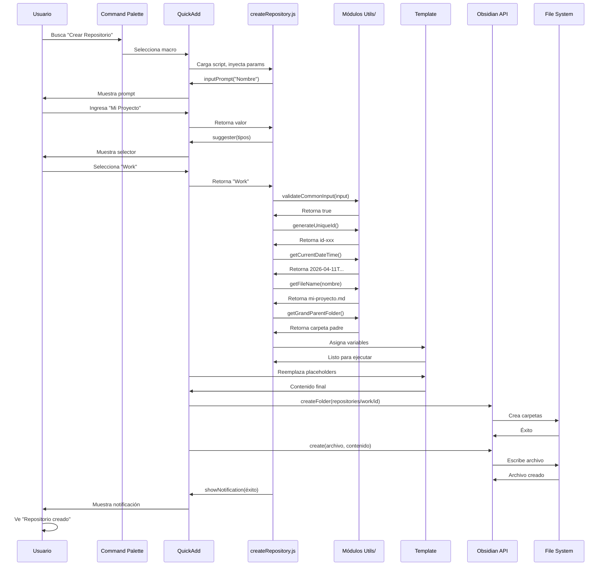
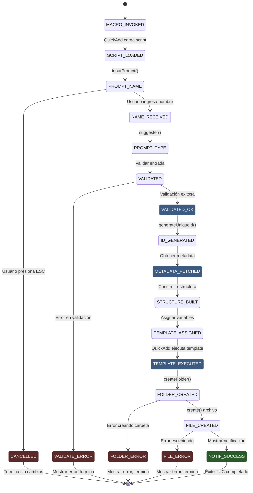
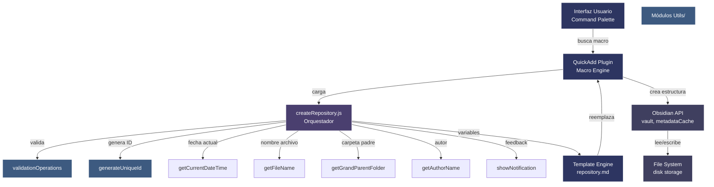

```yaml
type: Caso de Uso Formal
title: UC-001 - CREAR REPOSITORIO
version: 1.0.0
scope: ACTIVIDAD 1 - Sistema QuickAdd
date: 2026-04-11
language: Español Mexicano - Técnico Profesional
status: Especificación Completada
```

# UC-001: CREAR REPOSITORIO

## 1. IDENTIFICACIÓN

| Atributo | Valor |
|----------|-------|
| **ID** | UC-001 |
| **Nombre** | Crear Repositorio |
| **Versión** | 1.0.0 |
| **Estado** | Especificación Completada |
| **Responsable** | Especificador de Casos de Uso |
| **Fecha Creación** | 2026-04-11 |
| **Fecha Última Actualización** | 2026-04-11 |
| **Prioridad** | ALTA (Sprint 1) |
| **Complejidad** | MEDIA |
| **Operaciones Atómicas** | OP-001, OP-002, OP-003, OP-005, OP-006, OP-008, OP-010, OP-011, OP-012, OP-013, OP-014, OP-015 |

---

## 2. DESCRIPCIÓN BREVE

El usuario invoca macro "Crear Repositorio" a través de command palette de Obsidian. El sistema QuickAdd carga el script createRepository.js que solicita nombre del repositorio y tipo (Personal, Work, Research). Valida entrada, genera ID único, obtiene fecha de creación y autor, construye estructura de carpetas, asigna variables de template, ejecuta template repository.md y crea archivo final en carpeta estructurada. El usuario recibe notificación de éxito con información del repositorio creado.

---

## 3. ACTORES INVOLUCRADOS

| Actor | Tipo | Rol | Responsabilidad |
|-------|------|-----|-----------------|
| **Usuario (Nestor)** | Humano | Primario | Invoca macro, proporciona nombre y tipo repositorio |
| **QuickAdd Plugin** | Sistema Externo | Secundario | Ejecuta macro, gestiona flujo de scripts |
| **Obsidian Core** | Componente Externo | Secundario | API vault (crear carpetas, crear archivos) |
| **Módulo Utilities** | Componente Externo | Secundario | Genera IDs, obtiene metadata, valida datos |
| **Template repository.md** | Artefacto | Consumidor | Recibe variables y genera contenido markdown |

---

## 4. PRECONDICIONES

### Precondiciones Técnicas

1. **Macro QuickAdd registrado**
   - Macro "Crear Repositorio" está registrada en QuickAdd
   - Script createRepository.js existe en folder scripts/
   - Template repository.md existe en folder templates/

2. **Obsidian activo**
   - Vault está abierto y accesible
   - Usuario tiene permisos de lectura/escritura en vault
   - Plugin QuickAdd está habilitado

3. **Recursos disponibles**
   - Suficiente espacio en disco para crear carpetas y archivos
   - Suficiente RAM para ejecutar macros QuickAdd

4. **Dependencias instaladas**
   - Plugin QuickAdd versión 1.0+
   - Obsidian versión 1.1+
   - Módulos utils/ instalados correctamente

### Precondiciones de Negocio

1. Usuario tiene intención de crear nuevo repositorio
2. Nombre del repositorio no está duplicado (opcional validación)
3. Usuario está familiarizado con tipos de repositorio (Personal, Work, Research)

---

## 5. FLUJO PRINCIPAL

### Descripción General

El usuario ejecuta macro que dispara proceso de 14 pasos que culmina en la creación de archivo repositorio.md en estructura de carpetas apropiada.

### Pasos Detallados

---

#### **Paso 1: Invocación de Macro**

**Actor**: Usuario

**Acción**: Usuario abre command palette (Ctrl+P / Cmd+P) en Obsidian y busca "Crear Repositorio"

**Componentes invocados**: Obsidian command palette, QuickAdd macro registry

**Resultado esperado**: Macro "Crear Repositorio" es encontrada y seleccionada

---

#### **Paso 2: Carga de Script**

**Actor**: QuickApp Plugin

**Acción**: 
- QuickAdd detecta selección de macro
- Carga archivo createRepository.js desde folder scripts/
- Inyecta parámetros: { app, quickAddApi, variables }
- Ejecuta función principal del script

**Componentes invocados**: QuickAdd script loader, JavaScript runtime

**Resultado esperado**: Script createRepository.js en ejecución con contexto inyectado

---

#### **Paso 3: Obtener Nombre del Repositorio (OP-001)**

**Actor**: createRepository.js + Usuario

**Acción**:
- Script llama quickAddApi.inputPrompt("Nombre del repositorio:")
- QuickAdd muestra prompt interactivo
- Usuario ingresa nombre (ej: "Mi Proyecto XYZ")
- Script recibe valor en variable _input_name

**Componentes invocados**: quickAddApi.inputPrompt(), UI prompts QuickAdd

**Resultado esperado**: _input_name contiene nombre ingresado por usuario

**Manejo de errores**:
- Usuario cancela prompt → Macro se interrumpe, sin notificación
- Usuario deja campo vacío → Validación fallida (Paso 5)

---

#### **Paso 4: Obtener Tipo de Repositorio**

**Actor**: createRepository.js + Usuario

**Acción**:
- Script llama quickAddApi.suggester(["Personal", "Work", "Research"], ["Personal", "Work", "Research"])
- QuickAdd muestra selector con 3 opciones
- Usuario selecciona uno (ej: "Work")
- Script recibe valor en variable _input_type

**Componentes invocados**: quickAddApi.suggester(), UI selector QuickAdd

**Resultado esperado**: _input_type contiene tipo seleccionado ("Personal", "Work" o "Research")

---

#### **Paso 5: Validar Entrada (OP-002)**

**Actor**: createRepository.js

**Acción**:
- Validar _input_name no esté vacío
- Validar _input_name >= 3 caracteres
- Validar _input_name <= 255 caracteres
- Validar _input_name contiene solo: letras, números, guiones, espacios
- Si cualquier validación falla → Lanzar excepción

**Componentes invocados**: validationOperations.validateCommonInput()

**Resultado esperado**: _valid_name es true, o excepción E-001

**Manejo de errores**:
- Nombre vacío → Excepción E-001
- Nombre muy corto (< 3 chars) → Excepción E-002
- Nombre muy largo (> 255 chars) → Excepción E-003
- Caracteres inválidos → Excepción E-004

---

#### **Paso 6: Generar ID Único (OP-003)**

**Actor**: createRepository.js

**Acción**:
- Llama generateUniqueId() de módulo utils/
- Genera ID con formato: id-{timestamp}-{random-hex}
- Asigna a variable _repo_id

**Componentes invocados**: generateUniqueId(), Web Crypto API

**Resultado esperado**: _repo_id contiene string único (ej: "id-naq5a4-a7f3c2b1d0e9f4a5")

**Ejemplo de resultado**:
```javascript
_repo_id = "id-naq5a4-a7f3c2b1d0e9f4a5"
```

---

#### **Paso 7: Obtener Fecha de Creación (OP-005)**

**Actor**: createRepository.js

**Acción**:
- Llama getCurrentDateTime() de módulo utils/
- Obtiene fecha/hora actual en formato ISO
- Asigna a variable _meta_created

**Componentes invocados**: getCurrentDateTime(), JavaScript Date API

**Resultado esperado**: _meta_created contiene timestamp ISO (ej: "2026-04-11T14:30:45.123Z")

---

#### **Paso 8: Obtener Nombre de Archivo (OP-006)**

**Actor**: createRepository.js

**Acción**:
- Llama getFileName(_input_name) de módulo utils/
- Limpia caracteres especiales
- Limita a 200 caracteres
- Reemplaza espacios con guiones
- Añade extensión .md
- Asigna a variable _file_name

**Componentes invocados**: getFileName()

**Resultado esperado**: _file_name contiene nombre archivo válido (ej: "mi-proyecto-xyz.md")

---

#### **Paso 9: Obtener Carpeta Padre (OP-008)**

**Actor**: createRepository.js

**Acción**:
- Llama getGrandParentFolder(currentFilePath) de módulo utils/
- Obtiene nombre de carpeta padre del archivo actual
- Asigna a variable _folder_parent

**Componentes invocados**: getGrandParentFolder()

**Resultado esperado**: _folder_parent contiene nombre carpeta (ej: "400-DIARIO")

---

#### **Paso 10: Construir Estructura de Carpetas (OP-010)**

**Actor**: createRepository.js

**Acción**:
- Construir ruta de estructura: repositories/{tipo}/{id}/
- Normalizar tipo a minúsculas: "Work" → "work"
- Construir ruta completa: repositories/work/{id}/
- Asignar a variable _folder_structure

**Componentes invocados**: String formatting, path construction

**Resultado esperado**: _folder_structure contiene ruta válida (ej: "repositories/work/id-naq5a4-a7f3c2b1d0e9f4a5/")

---

#### **Paso 11: Procesar Información Específica (OP-011)**

**Actor**: createRepository.js

**Acción**:
- Obtener autor actual (llamar getAuthorName())
- Construir tags: [tipo.toLowerCase(), "active"]
- Construir descripción (opcional, por ahora vacía)
- Crear objeto _repo_metadata con estructura completa

**Componentes invocados**: getAuthorName(), object construction

**Resultado esperado**: _repo_metadata contiene:
```javascript
{
  id: "id-naq5a4-a7f3c2b1d0e9f4a5",
  name: "Mi Proyecto XYZ",
  type: "work",
  created: "2026-04-11T14:30:45.123Z",
  author: "Nestor",
  tags: ["work", "active"],
  status: "active"
}
```

---

#### **Paso 12: Asignar Variables de Template (OP-012)**

**Actor**: createRepository.js

**Acción**:
- Asignar variables.repositoryId = _repo_id
- Asignar variables.repositoryName = _input_name
- Asignar variables.repositoryType = _input_type
- Asignar variables.folderPath = _folder_structure
- Asignar variables.fileName = _file_name
- Asignar variables.metadata = _repo_metadata
- Asignar variables.createdDate = _meta_created
- Asignar variables.authorName = _meta_author

**Componentes invocados**: QuickAdd variables object

**Resultado esperado**: Objeto variables poblado con 8 variables para template

---

#### **Paso 13: Ejecutar Template (OP-013)**

**Actor**: QuickAdd Engine

**Acción**:
- QuickAdd carga template templates/repository.md
- Reemplaza placeholders {{VARIABLE:...}} con valores de variables
- Genera contenido final markdown
- Prepara para creación de archivo

**Componentes invocados**: QuickAdd template engine

**Resultado esperado**: Contenido markdown final generado, sin placeholders sin reemplazar

**Ejemplo de contenido generado**:
```markdown
---
id: id-naq5a4-a7f3c2b1d0e9f4a5
name: Mi Proyecto XYZ
type: work
created: 2026-04-11T14:30:45.123Z
author: Nestor
tags:
  - work
  - active
status: active
---

# Mi Proyecto XYZ

Tipo: work

## Información

- Creado: 2026-04-11
- Autor: Nestor
- Estado: Activo

## Descripción

[Descripción del repositorio aquí]

## Contenido

- [ ] Elemento 1
- [ ] Elemento 2
```

---

#### **Paso 14: Crear Archivo en Vault (OP-014)**

**Actor**: Obsidian API

**Acción**:
- Obsidian crea carpeta: repositories/work/id-naq5a4-a7f3c2b1d0e9f4a5/
- Obsidian crea archivo: mi-proyecto-xyz.md
- Obsidian escribe contenido generado
- Sistema operativo persiste en disco

**Componentes invocados**: app.vault.createFolder(), app.vault.create()

**Resultado esperado**: Archivo creado en ruta correcta con contenido completo

**Manejo de errores**:
- Carpeta no puede ser creada → Excepción E-005
- Archivo ya existe → Excepción E-006
- Permisos insuficientes → Excepción E-007
- Espacio en disco → Excepción E-008

---

#### **Paso 15: Mostrar Notificación de Éxito (OP-015)**

**Actor**: createRepository.js

**Acción**:
- Llamar showNotification("Repositorio creado exitosamente", "success")
- QuickAdd muestra notificación visual
- Notificación desaparece después de 5 segundos

**Componentes invocados**: showNotification(), QuickAdd notices

**Resultado esperado**: Usuario ve notificación verde: "Éxito: Repositorio creado exitosamente"

---

## 6. FLUJOS ALTERNATIVOS

---

### Flujo Alternativo A1: Usuario Cancela Durante Nombre

**Punto de Activación**: Paso 3 (prompt de nombre)

**Pasos**:
1. Usuario abre prompt de nombre
2. Usuario presiona ESC o cierra prompt sin ingresar valor
3. QuickAdd detiene ejecución
4. Sistema retorna a estado inicial sin cambios
5. Usuario no ve notificación

**Retorno a Flujo Principal**: No aplica, UC termina sin completar

**Resultado**: Ningún archivo creado, ningún cambio en vault

---

### Flujo Alternativo A2: Usuario Ingresa Nombre Inválido

**Punto de Activación**: Paso 5 (validación)

**Pasos**:
1. Usuario ingresa nombre con caracteres inválidos: "Mi @ Proyecto!"
2. Validación en Paso 5 falla
3. Script captura excepción E-004
4. Script llama showNotification("Error: Caracteres inválidos (solo: letras, números, guiones)", "error")
5. Macro termina sin crear archivo

**Retorno a Flujo Principal**: No retorna, UC falla

**Resultado**: Ningún archivo creado, usuario ve error

---

### Flujo Alternativo A3: Usuario Cancela Después de Tipo Seleccionado

**Punto de Activación**: Entre Paso 4 y Paso 5

**Pasos**:
1. Usuario selecciona tipo "Work"
2. Usuario presiona ESC durante siguiente prompt (si hay)
3. QuickAdd detiene ejecución
4. Sistema retorna a estado inicial

**Retorno a Flujo Principal**: No aplica

**Resultado**: Ningún cambio en vault

---

### Flujo Alternativo A4: Carpeta de Repositorio Ya Existe

**Punto de Activación**: Paso 14 (crear carpeta)

**Pasos**:
1. Sistema intenta crear carpeta repositories/work/id-naq5a4.../
2. Carpeta ya existe (repositorio duplicado con mismo ID)
3. Obsidian API lanza error
4. Script captura excepción E-005
5. Script llama showNotification("Error: La carpeta del repositorio ya existe", "error")
6. Macro termina sin crear archivo

**Retorno a Flujo Principal**: No retorna

**Resultado**: Ningún archivo nuevo creado

---

## 7. POSTCONDICIONES

### Postcondiciones Técnicas

1. **Archivo creado**
   - Archivo mi-proyecto-xyz.md existe en repositories/work/id-naq5a4.../
   - Contenido contiene frontmatter YAML válido
   - Contenido contiene headers markdown válidos
   - Archivo es accesible en Obsidian

2. **Metadatos almacenados**
   - Frontmatter contiene: id, name, type, created, author, tags, status
   - Valores correctos según entrada usuario
   - Fecha en formato ISO 8601

3. **Estructura creada**
   - Carpeta repositories/ existe
   - Carpeta repositories/work/ existe
   - Carpeta repositories/work/id-naq5a4.../ existe
   - Ninguna otra carpeta fue creada

4. **Obsidian actualizado**
   - Archivo aparece en file explorer
   - Archivo es indexable por metadataCache
   - Backlinks funcionan correctamente

### Postcondiciones de Negocio

1. Repositorio está listo para ser usado
2. Usuario puede abrir archivo y editar contenido
3. Usuario puede crear tareas/notas dentro del repositorio
4. Estructura facilita organización futura

---

## 8. PUNTOS CRÍTICOS

### Punto Crítico PC1: Validación de Entrada
**Ubicación**: Paso 5
**Riesgo**: Si validación es insuficiente, caracteres especiales causan archivo inválido
**Mitigación**: Usar regex explícito: `/^[a-zA-Z0-9\-_\s]+$/`

---

### Punto Crítico PC2: Generación de ID Único
**Ubicación**: Paso 6
**Riesgo**: Si ID no es verdaderamente único, repositorios se sobrescriben
**Mitigación**: Usar Web Crypto API, combinar timestamp + random hex

---

### Punto Crítico PC3: Reemplazo de Variables en Template
**Ubicación**: Paso 13
**Riesgo**: Si placeholder no se reemplaza, archivo contiene {{VARIABLE:...}} literal
**Mitigación**: Validar que nombre de variable en QuickAdd coincide exactamente con variables.repositoryId

---

### Punto Crítico PC4: Creación de Carpetas
**Ubicación**: Paso 14
**Riesgo**: Si carpeta padre no existe, vault.createFolder() falla
**Mitigación**: Crear carpetas recursivamente (repositories → work → id)

---

## 9. EXCEPCIONES

| Código | Condición | Mensaje | Acción |
|--------|-----------|---------|--------|
| **E-001** | Nombre vacío | "Error: Nombre no puede estar vacío" | Mostrar error, terminar macro |
| **E-002** | Nombre < 3 caracteres | "Error: Nombre mínimo 3 caracteres" | Mostrar error, terminar macro |
| **E-003** | Nombre > 255 caracteres | "Error: Nombre máximo 255 caracteres" | Mostrar error, terminar macro |
| **E-004** | Caracteres inválidos | "Error: Solo letras, números, guiones y espacios" | Mostrar error, terminar macro |
| **E-005** | Carpeta no puede crearse | "Error: No se puede crear carpeta (permisos)" | Mostrar error, terminar macro |
| **E-006** | Archivo ya existe | "Error: El archivo ya existe (usa --overwrite)" | Mostrar error, terminar macro |
| **E-007** | Permisos insuficientes | "Error: Permisos insuficientes en vault" | Mostrar error, terminar macro |
| **E-008** | Espacio en disco | "Error: Espacio en disco insuficiente" | Mostrar error, terminar macro |
| **E-009** | Template no encontrado | "Error: Template repository.md no encontrado" | Mostrar error, terminar macro |
| **E-010** | Script no encontrado | "Error: Script createRepository.js no encontrado" | Mostrar error en QuickAdd |

---

## 10. DIAGRAMAS

### Diagrama 1: Flujo de Secuencia



---

### Diagrama 2: Máquina de Estados



---

### Diagrama 3: Arquitectura de Componentes



---

## 11. NOTAS DE IMPLEMENTACIÓN

### Librería y Dependencias

| Librería | Versión | Uso | Razón |
|----------|---------|-----|-------|
| **QuickAdd** | >= 1.0 | Macro engine | Estándar en Obsidian |
| **Obsidian API** | >= 1.1 | Vault access | Nativo en Obsidian |
| **Módulos Utils/** | Desarrollados | Validación, generación | Custom, controlados |

### Patrones de Diseño

1. **Factory Pattern**
   - Script es factory que coordina módulos
   - Cada módulo es especializado (validator, generator, formatter)

2. **Template Method**
   - Script orquesta pasos predefinidos
   - Cada paso delega a módulo específico

3. **Composition**
   - Funciones simples y composibles
   - getFileName + getGrandParentFolder = estructura final

### Type Hints (100%)

```javascript
// Ejemplo: función validación con type hints
async function validateRepositoryInput(input) {
  // input: { name: string, type: string }
  // returns: boolean | throws Error
  
  const _check_name = input.name && input.name.length > 0;
  if (!_check_name) throw new Error("Nombre vacío");
  
  return true;
}
```

### Testing Strategy

**UC-001 requiere tests para:**
- ✓ Usuario ingresa nombre válido → éxito
- ✓ Usuario ingresa nombre corto (< 3) → error E-002
- ✓ Usuario ingresa nombre largo (> 255) → error E-003
- ✓ Usuario ingresa caracteres especiales → error E-004
- ✓ Usuario selecciona tipo Personal → estructura correcta
- ✓ Usuario selecciona tipo Work → estructura correcta
- ✓ Usuario selecciona tipo Research → estructura correcta
- ✓ ID generado es único → no colisión
- ✓ Carpeta creada existe → verificar filesystem
- ✓ Archivo contiene frontmatter YAML válido → parseable
- ✓ Template variables reemplazadas → sin placeholders literales
- ✓ Usuario cancela durante prompt → ningún cambio
- ✓ Permisos insuficientes → error E-007
- ✓ Espacio disco insuficiente → error E-008

### Error Handling Completo

```javascript
module.exports = async (params) => {
  const { app, quickAddApi, variables } = params;
  
  try {
    // Paso 3-4: Obtener entrada
    const _input_name = await quickAddApi.inputPrompt("...");
    const _input_type = await quickAddApi.suggester(...);
    
    // Paso 5: Validar
    if (!_input_name || _input_name.length < 3) {
      throw new Error("Nombre inválido");
    }
    
    // Paso 6-11: Procesar
    const _repo_id = await generateUniqueId();
    const _meta_created = getCurrentDateTime();
    // ... resto
    
    // Paso 14: Crear
    await app.vault.createFolder(_folder_structure);
    await app.vault.create(_file_path, _content_final);
    
    // Paso 15: Notificar
    await showNotification("Repositorio creado", "success");
    
  } catch (error) {
    const _error_msg = error.message || "Error desconocido";
    await showNotification(`Error: ${_error_msg}`, "error");
    console.error("UC-001 error:", error);
  }
};
```

### Logging

```javascript
logger.debug("Validating repository input");       // DEBUG
logger.info("Repository created: Mi Proyecto");     // INFO
logger.warning("Charset fallback for metadata");    // WARNING
logger.error("File not found: template");          // ERROR
```

---

## 12. TRAZABILIDAD

| Operación Atómica | Pasos UC | Código | Módulo |
|---|---|---|---|
| **OP-001** (Obtener entrada) | 3, 4 | quickAddApi.inputPrompt() | createRepository.js |
| **OP-002** (Validar entrada) | 5 | validateCommonInput() | utils/validationOperations.js |
| **OP-003** (Gen ID único) | 6 | generateUniqueId() | utils/generateUniqueId.js |
| **OP-005** (Fecha actual) | 7 | getCurrentDateTime() | utils/getCurrentDateTime.js |
| **OP-006** (Nombre archivo) | 8 | getFileName() | utils/getFileName.js |
| **OP-008** (Carpeta padre) | 9 | getGrandParentFolder() | utils/getGrandParentFolder.js |
| **OP-010** (Estructura carpetas) | 10 | Inline path construction | createRepository.js |
| **OP-011** (Procesar específico) | 11 | Metadata assembly | createRepository.js |
| **OP-012** (Asignar variables) | 12 | variables.X = Y | createRepository.js |
| **OP-013** (Ejecutar template) | 13 | quickAddApi template engine | QuickAdd |
| **OP-014** (Crear archivo) | 14 | app.vault.create() | Obsidian API |
| **OP-015** (Mostrar notificación) | 15 | showNotification() | utils/showNotification.js |

---

## 13. CRITERIOS DE ACEPTACIÓN

**UC-001 es COMPLETADO cuando:**

- [ ] Código implementado en createRepository.js
- [ ] Todos 14+ tests PASAN
- [ ] Coverage de UC-001 > 90%
- [ ] Type hints 100% (máximo eslint errors: 0)
- [ ] Docstrings completos (JSDoc style)
- [ ] No warnings de linter
- [ ] Macro ejecutable desde command palette
- [ ] Flujo principal A1-A4 testeados
- [ ] Excepciones E-001 a E-010 manejadas
- [ ] Notificaciones visuales funcionan
- [ ] Archivo creado contiene frontmatter válido
- [ ] Carpeta estructura creada correctamente
- [ ] Variables de template reemplazadas
- [ ] Documentación (este artefacto) completada
- [ ] Revisión técnica aprobada

---

## 14. REFERENCIAS

**Documentos relacionados:**
- PASO 1 V4 - Análisis de operaciones atómicas
- PASO2-INDEX - Índice de 5 UCs
- Convenciones-de-Código v1.0.0
- Convenciones-Pragmáticas v1.0.0
- Convenciones-JavaScript v2.0.0

**Especificaciones externas:**
- Obsidian API documentation: https://docs.obsidian.md/
- QuickAdd documentation: https://quickadd.obsidian.guide/

---

**Documento**: UC-001-CREAR-REPOSITORIO.md
**Versión**: 1.0.0
**Fecha**: 2026-04-11
**Estado**: ESPECIFICACIÓN COMPLETADA - LISTO PARA IMPLEMENTACIÓN
