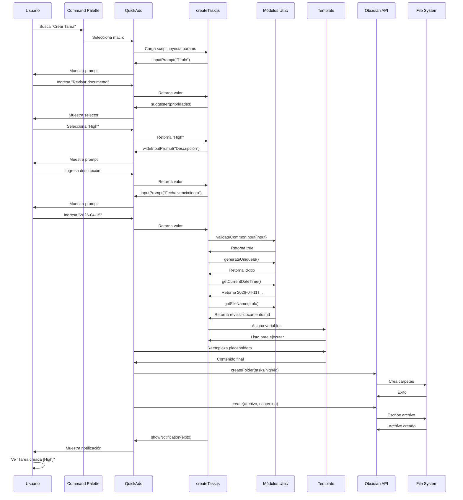
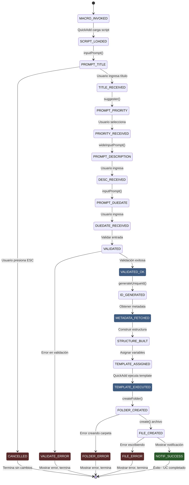

```yaml
type: Caso de Uso Formal
title: UC-002 - CREAR TAREA
version: 1.0.0
scope: ACTIVIDAD 1 - Sistema QuickAdd
date: 2026-04-11
language: Español Mexicano - Técnico Profesional
status: Especificación Completada
```

# UC-002: CREAR TAREA

## 1. IDENTIFICACIÓN

| Atributo | Valor |
|----------|-------|
| **ID** | UC-002 |
| **Nombre** | Crear Tarea |
| **Versión** | 1.0.0 |
| **Estado** | Especificación Completada |
| **Responsable** | Especificador de Casos de Uso |
| **Fecha Creación** | 2026-04-11 |
| **Fecha Última Actualización** | 2026-04-11 |
| **Prioridad** | ALTA (Sprint 1) |
| **Complejidad** | MEDIA |
| **Operaciones Atómicas** | OP-001, OP-002, OP-003, OP-005, OP-006, OP-007, OP-011, OP-012, OP-013, OP-014, OP-015 |

---

## 2. DESCRIPCIÓN BREVE

El usuario invoca macro "Crear Tarea" a través de command palette de Obsidian. El sistema QuickAdd carga el script createTask.js que solicita título de la tarea, prioridad (High, Normal, Low), descripción opcional y fecha de vencimiento. Valida entrada, genera ID único, obtiene fecha de creación y metadatos, construye estructura de carpetas por prioridad, asigna variables de template, ejecuta template task.md y crea archivo final en carpeta estructurada con estado inicial "pending". El usuario recibe notificación de éxito con información de la tarea creada.

---

## 3. ACTORES INVOLUCRADOS

| Actor | Tipo | Rol | Responsabilidad |
|-------|------|-----|-----------------|
| **Usuario (Nestor)** | Humano | Primario | Invoca macro, proporciona título, prioridad, fecha vencimiento |
| **QuickAdd Plugin** | Sistema Externo | Secundario | Ejecuta macro, gestiona flujo de scripts |
| **Obsidian Core** | Componente Externo | Secundario | API vault (crear carpetas, crear archivos) |
| **Módulo Utilities** | Componente Externo | Secundario | Genera IDs, obtiene metadata, valida datos |
| **Template task.md** | Artefacto | Consumidor | Recibe variables y genera contenido markdown con estado |

---

## 4. PRECONDICIONES

### Precondiciones Técnicas

1. **Macro QuickAdd registrado**
   - Macro "Crear Tarea" está registrada en QuickAdd
   - Script createTask.js existe en folder scripts/
   - Template task.md existe en folder templates/

2. **Obsidian activo**
   - Vault está abierto y accesible
   - Usuario tiene permisos de lectura/escritura en vault
   - Plugin QuickAdd está habilitado

3. **Recursos disponibles**
   - Suficiente espacio en disco para crear carpetas y archivos
   - Suficiente RAM para ejecutar macros QuickAdd

4. **Dependencias instaladas**
   - Plugin QuickAdd versión 1.0+
   - Obsidian versión 1.1+
   - Módulos utils/ instalados correctamente

### Precondiciones de Negocio

1. Usuario tiene intención de crear nueva tarea
2. Usuario está familiarizado con niveles de prioridad (High, Normal, Low)
3. Fecha de vencimiento es opcional pero recomendada

---

## 5. FLUJO PRINCIPAL

### Descripción General

El usuario ejecuta macro que dispara proceso de 13 pasos que culmina en la creación de archivo task.md en estructura de carpetas por prioridad, con estado inicial "pending".

### Pasos Detallados

---

#### **Paso 1: Invocación de Macro**

**Actor**: Usuario

**Acción**: Usuario abre command palette (Ctrl+P / Cmd+P) en Obsidian y busca "Crear Tarea"

**Componentes invocados**: Obsidian command palette, QuickAdd macro registry

**Resultado esperado**: Macro "Crear Tarea" es encontrada y seleccionada

---

#### **Paso 2: Carga de Script**

**Actor**: QuickAdd Plugin

**Acción**: 
- QuickAdd detecta selección de macro
- Carga archivo createTask.js desde folder scripts/
- Inyecta parámetros: { app, quickAddApi, variables }
- Ejecuta función principal del script

**Componentes invocados**: QuickAdd script loader, JavaScript runtime

**Resultado esperado**: Script createTask.js en ejecución con contexto inyectado

---

#### **Paso 3: Obtener Título de la Tarea (OP-001)**

**Actor**: createTask.js + Usuario

**Acción**:
- Script llama quickAddApi.inputPrompt("Título de la tarea:")
- QuickAdd muestra prompt interactivo
- Usuario ingresa título (ej: "Revisar documento XYZ")
- Script recibe valor en variable _input_title

**Componentes invocados**: quickAddApi.inputPrompt(), UI prompts QuickAdd

**Resultado esperado**: _input_title contiene título ingresado por usuario

**Manejo de errores**:
- Usuario cancela prompt → Macro se interrumpe, sin notificación
- Usuario deja campo vacío → Validación fallida (Paso 5)

---

#### **Paso 4: Obtener Prioridad de la Tarea**

**Actor**: createTask.js + Usuario

**Acción**:
- Script llama quickAddApi.suggester(["High", "Normal", "Low"], ["High", "Normal", "Low"])
- QuickAdd muestra selector con 3 opciones
- Usuario selecciona uno (ej: "High")
- Script recibe valor en variable _input_priority

**Componentes invocados**: quickAddApi.suggester(), UI selector QuickAdd

**Resultado esperado**: _input_priority contiene prioridad seleccionada ("High", "Normal" o "Low")

---

#### **Paso 5: Obtener Descripción Opcional**

**Actor**: createTask.js + Usuario

**Acción**:
- Script llama quickAddApi.wideInputPrompt("Descripción (opcional):")
- QuickAdd muestra prompt multi-línea
- Usuario ingresa descripción o deja vacío (ambos válidos)
- Script recibe valor en variable _input_description

**Componentes invocados**: quickAddApi.wideInputPrompt(), UI prompts QuickAdd

**Resultado esperado**: _input_description contiene descripción (puede ser string vacío)

---

#### **Paso 6: Obtener Fecha de Vencimiento Opcional**

**Actor**: createTask.js + Usuario

**Acción**:
- Script llama quickAddApi.inputPrompt("Fecha vencimiento (YYYY-MM-DD, opcional):")
- QuickAdd muestra prompt
- Usuario ingresa fecha o deja vacío
- Script recibe valor en variable _input_due_date

**Componentes invocados**: quickAddApi.inputPrompt(), UI prompts QuickAdd

**Resultado esperado**: _input_due_date contiene fecha (puede ser string vacío)

---

#### **Paso 7: Validar Entrada (OP-002)**

**Actor**: createTask.js

**Acción**:
- Validar _input_title no esté vacío
- Validar _input_title >= 3 caracteres
- Validar _input_title <= 255 caracteres
- Validar _input_title contiene solo: letras, números, guiones, espacios
- Si _input_due_date no vacío: validar formato YYYY-MM-DD
- Si cualquier validación falla → Lanzar excepción

**Componentes invocados**: validationOperations.validateCommonInput(), custom date validation

**Resultado esperado**: _valid_input es true, o excepción E-001 a E-005

**Manejo de errores**:
- Título vacío → Excepción E-001
- Título muy corto → Excepción E-002
- Título muy largo → Excepción E-003
- Caracteres inválidos → Excepción E-004
- Fecha formato inválido → Excepción E-005

---

#### **Paso 8: Generar ID Único (OP-003)**

**Actor**: createTask.js

**Acción**:
- Llama generateUniqueId() de módulo utils/
- Genera ID con formato: id-{timestamp}-{random-hex}
- Asigna a variable _task_id

**Componentes invocados**: generateUniqueId(), Web Crypto API

**Resultado esperado**: _task_id contiene string único (ej: "id-naq5a5-b8f4d3c2e1a9f5b6")

---

#### **Paso 9: Obtener Fecha de Creación (OP-005)**

**Actor**: createTask.js

**Acción**:
- Llama getCurrentDateTime() de módulo utils/
- Obtiene fecha/hora actual en formato ISO
- Asigna a variable _meta_created

**Componentes invocados**: getCurrentDateTime(), JavaScript Date API

**Resultado esperado**: _meta_created contiene timestamp ISO (ej: "2026-04-11T14:35:22.456Z")

---

#### **Paso 10: Obtener Nombre de Archivo (OP-006)**

**Actor**: createTask.js

**Acción**:
- Llama getFileName(_input_title) de módulo utils/
- Limpia caracteres especiales
- Limita a 200 caracteres
- Reemplaza espacios con guiones
- Añade extensión .md
- Asigna a variable _file_name

**Componentes invocados**: getFileName()

**Resultado esperado**: _file_name contiene nombre archivo válido (ej: "revisar-documento-xyz.md")

---

#### **Paso 11: Obtener Metadata de Contexto (OP-007)**

**Actor**: createTask.js

**Acción**:
- Obtener autor actual (getAuthorName())
- Normalizar prioridad a minúsculas: "High" → "high"
- Construir tags: [prioridad, "task", "pending"]
- Crear objeto _task_metadata con estructura completa

**Componentes invocados**: getAuthorName(), object construction

**Resultado esperado**: _task_metadata contiene:
```javascript
{
  id: "id-naq5a5-b8f4d3c2e1a9f5b6",
  title: "Revisar documento XYZ",
  priority: "high",
  created: "2026-04-11T14:35:22.456Z",
  author: "Nestor",
  tags: ["high", "task", "pending"],
  status: "pending",
  dueDate: "2026-04-15" // Si fue ingresada
}
```

---

#### **Paso 12: Construir Estructura de Carpetas (OP-010)**

**Actor**: createTask.js

**Acción**:
- Construir ruta de estructura: tasks/{prioridad}/{id}/
- Normalizar prioridad a minúsculas: "High" → "high"
- Construir ruta completa: tasks/high/{id}/
- Asignar a variable _folder_structure

**Componentes invocados**: String formatting, path construction

**Resultado esperado**: _folder_structure contiene ruta válida (ej: "tasks/high/id-naq5a5-b8f4d3c2e1a9f5b6/")

---

#### **Paso 13: Asignar Variables de Template (OP-012)**

**Actor**: createTask.js

**Acción**:
- Asignar variables.taskId = _task_id
- Asignar variables.taskTitle = _input_title
- Asignar variables.taskPriority = _input_priority
- Asignar variables.taskDescription = _input_description
- Asignar variables.taskDueDate = _input_due_date
- Asignar variables.folderPath = _folder_structure
- Asignar variables.fileName = _file_name
- Asignar variables.metadata = _task_metadata
- Asignar variables.status = "pending"

**Componentes invocados**: QuickAdd variables object

**Resultado esperado**: Objeto variables poblado con 9 variables para template

---

#### **Paso 14: Ejecutar Template (OP-013)**

**Actor**: QuickAdd Engine

**Acción**:
- QuickAdd carga template templates/task.md
- Reemplaza placeholders {{VARIABLE:...}} con valores de variables
- Genera contenido final markdown con estado inicial "pending"
- Prepara para creación de archivo

**Componentes invocados**: QuickAdd template engine

**Resultado esperado**: Contenido markdown final generado, sin placeholders sin reemplazar

**Ejemplo de contenido generado**:
```markdown
---
id: id-naq5a5-b8f4d3c2e1a9f5b6
title: Revisar documento XYZ
priority: high
status: pending
created: 2026-04-11T14:35:22.456Z
dueDate: 2026-04-15
author: Nestor
tags:
  - high
  - task
  - pending
---

# [PENDING] Revisar documento XYZ

**Prioridad:** High
**Estado:** Pending
**Creado:** 2026-04-11
**Vencimiento:** 2026-04-15

## Descripción

Revisar documento XYZ y proporcionar feedback

## Checklist

- [ ] Completado

## Notas

[Agregar notas aquí]
```

---

#### **Paso 15: Crear Archivo en Vault (OP-014)**

**Actor**: Obsidian API

**Acción**:
- Obsidian crea carpeta: tasks/high/id-naq5a5-b8f4d3c2e1a9f5b6/
- Obsidian crea archivo: revisar-documento-xyz.md
- Obsidian escribe contenido generado
- Sistema operativo persiste en disco

**Componentes invocados**: app.vault.createFolder(), app.vault.create()

**Resultado esperado**: Archivo creado en ruta correcta con contenido completo

**Manejo de errores**:
- Carpeta no puede ser creada → Excepción E-006
- Archivo ya existe → Excepción E-007
- Permisos insuficientes → Excepción E-008
- Espacio en disco → Excepción E-009

---

#### **Paso 16: Mostrar Notificación de Éxito (OP-015)**

**Actor**: createTask.js

**Acción**:
- Llamar showNotification("Tarea creada: Revisar documento XYZ [High]", "success")
- QuickAdd muestra notificación visual
- Notificación desaparece después de 5 segundos

**Componentes invocados**: showNotification(), QuickAdd notices

**Resultado esperado**: Usuario ve notificación verde: "Éxito: Tarea creada: Revisar documento XYZ [High]"

---

## 6. FLUJOS ALTERNATIVOS

---

### Flujo Alternativo A1: Usuario Cancela Durante Título

**Punto de Activación**: Paso 3 (prompt de título)

**Pasos**:
1. Usuario abre prompt de título
2. Usuario presiona ESC o cierra prompt sin ingresar valor
3. QuickAdd detiene ejecución
4. Sistema retorna a estado inicial sin cambios
5. Usuario no ve notificación

**Retorno a Flujo Principal**: No aplica, UC termina sin completar

**Resultado**: Ningún archivo creado, ningún cambio en vault

---

### Flujo Alternativo A2: Usuario Ingresa Título Inválido

**Punto de Activación**: Paso 7 (validación)

**Pasos**:
1. Usuario ingresa título con caracteres inválidos: "Revisar @ documento!"
2. Validación en Paso 7 falla
3. Script captura excepción E-004
4. Script llama showNotification("Error: Caracteres inválidos", "error")
5. Macro termina sin crear archivo

**Retorno a Flujo Principal**: No retorna, UC falla

**Resultado**: Ningún archivo creado, usuario ve error

---

### Flujo Alternativo A3: Usuario Ingresa Fecha Vencimiento Inválida

**Punto de Activación**: Paso 7 (validación de fecha)

**Pasos**:
1. Usuario ingresa fecha con formato incorrecto: "15/04/2026" (en lugar de "2026-04-15")
2. Validación de fecha falla
3. Script captura excepción E-005
4. Script llama showNotification("Error: Fecha debe ser YYYY-MM-DD", "error")
5. Macro termina sin crear archivo

**Retorno a Flujo Principal**: No retorna, UC falla

**Resultado**: Ningún archivo creado

---

## 7. POSTCONDICIONES

### Postcondiciones Técnicas

1. **Archivo creado**
   - Archivo revisar-documento-xyz.md existe en tasks/high/id-naq5a5.../
   - Contenido contiene frontmatter YAML válido con status "pending"
   - Contenido contiene headers markdown válidos
   - Archivo es accesible en Obsidian

2. **Metadatos almacenados**
   - Frontmatter contiene: id, title, priority, status, created, dueDate, author, tags
   - Valores correctos según entrada usuario
   - Status inicial es "pending"
   - Fecha en formato ISO 8601

3. **Estructura creada**
   - Carpeta tasks/ existe
   - Carpeta tasks/high/ (según prioridad) existe
   - Carpeta tasks/high/id-naq5a5.../ existe
   - Ninguna otra carpeta fue creada

4. **Obsidian actualizado**
   - Archivo aparece en file explorer
   - Archivo es indexable por metadataCache
   - Backlinks funcionan correctamente

### Postcondiciones de Negocio

1. Tarea está lista para ser ejecutada
2. Usuario puede abrir archivo y editar contenido
3. Estado inicial es "pending" (no completada)
4. Prioridad facilita organización y filtrado

---

## 8. PUNTOS CRÍTICOS

### Punto Crítico PC1: Validación de Fecha
**Ubicación**: Paso 7
**Riesgo**: Si formato de fecha no es validado, tarea tendrá metadata corrupta
**Mitigación**: Usar regex para YYYY-MM-DD: `/^\d{4}-\d{2}-\d{2}$/`

---

### Punto Crítico PC2: Prioridad Estructura
**Ubicación**: Paso 12
**Riesgo**: Si prioridad no es normalizada a minúsculas, estructura de carpetas será inconsistente
**Mitigación**: Siempre normalizar: _input_priority.toLowerCase()

---

### Punto Crítico PC3: Status Inicial
**Ubicación**: Paso 14 (template)
**Riesgo**: Si status no es "pending" inicialmente, tarea se verá como completada
**Mitigación**: Asignar variables.status = "pending" explícitamente

---

## 9. EXCEPCIONES

| Código | Condición | Mensaje | Acción |
|--------|-----------|---------|--------|
| **E-001** | Título vacío | "Error: Título no puede estar vacío" | Mostrar error, terminar macro |
| **E-002** | Título < 3 caracteres | "Error: Título mínimo 3 caracteres" | Mostrar error, terminar macro |
| **E-003** | Título > 255 caracteres | "Error: Título máximo 255 caracteres" | Mostrar error, terminar macro |
| **E-004** | Caracteres inválidos | "Error: Solo letras, números, guiones y espacios" | Mostrar error, terminar macro |
| **E-005** | Fecha formato inválido | "Error: Fecha debe ser YYYY-MM-DD" | Mostrar error, terminar macro |
| **E-006** | Carpeta no puede crearse | "Error: No se puede crear carpeta (permisos)" | Mostrar error, terminar macro |
| **E-007** | Archivo ya existe | "Error: El archivo ya existe" | Mostrar error, terminar macro |
| **E-008** | Permisos insuficientes | "Error: Permisos insuficientes en vault" | Mostrar error, terminar macro |
| **E-009** | Espacio en disco | "Error: Espacio en disco insuficiente" | Mostrar error, terminar macro |
| **E-010** | Template no encontrado | "Error: Template task.md no encontrado" | Mostrar error, terminar macro |

---

## 10. DIAGRAMAS

### Diagrama 1: Flujo de Secuencia



---

### Diagrama 2: Máquina de Estados



---

## 11. NOTAS DE IMPLEMENTACIÓN

### Librería y Dependencias

| Librería | Versión | Uso | Razón |
|----------|---------|-----|-------|
| **QuickAdd** | >= 1.0 | Macro engine | Estándar en Obsidian |
| **Obsidian API** | >= 1.1 | Vault access | Nativo en Obsidian |
| **Módulos Utils/** | Desarrollados | Validación, generación | Custom, controlados |

### Patrones de Diseño

1. **Factory Pattern**
   - Script es factory que coordina módulos
   - Cada módulo es especializado

2. **Template Method**
   - Script orquesta pasos predefinidos
   - Cada paso delega a módulo específico

3. **Composition**
   - Funciones simples y composibles

### Testing Strategy

**UC-002 requiere tests para:**
- ✓ Usuario ingresa título válido → éxito
- ✓ Usuario selecciona prioridad High → estructura tasks/high/
- ✓ Usuario selecciona prioridad Normal → estructura tasks/normal/
- ✓ Usuario selecciona prioridad Low → estructura tasks/low/
- ✓ Usuario ingresa fecha válida → metadata correcta
- ✓ Usuario deja fecha vacía → metadata sin dueDate
- ✓ Usuario ingresa fecha inválida → error E-005
- ✓ Archivo creado tiene status "pending" → verificar frontmatter
- ✓ Template variables reemplazadas → sin placeholders literales
- ✓ Usuario cancela durante prompt → ningún cambio
- ✓ Carpeta estructura creada correctamente → verificar filesystem

---

## 12. TRAZABILIDAD

| Operación Atómica | Pasos UC | Código | Módulo |
|---|---|---|---|
| **OP-001** (Obtener entrada) | 3, 4, 5, 6 | quickAddApi.inputPrompt/suggester | createTask.js |
| **OP-002** (Validar entrada) | 7 | validateCommonInput() | utils/validationOperations.js |
| **OP-003** (Gen ID único) | 8 | generateUniqueId() | utils/generateUniqueId.js |
| **OP-005** (Fecha actual) | 9 | getCurrentDateTime() | utils/getCurrentDateTime.js |
| **OP-006** (Nombre archivo) | 10 | getFileName() | utils/getFileName.js |
| **OP-007** (Obtener metadata) | 11 | getAuthorName() + tags | utils/getAuthorName.js |
| **OP-010** (Estructura carpetas) | 12 | Inline path construction | createTask.js |
| **OP-011** (Procesar específico) | 11 | Priority mapping, status init | createTask.js |
| **OP-012** (Asignar variables) | 13 | variables.X = Y | createTask.js |
| **OP-013** (Ejecutar template) | 14 | quickAddApi template engine | QuickAdd |
| **OP-014** (Crear archivo) | 15 | app.vault.create() | Obsidian API |
| **OP-015** (Mostrar notificación) | 16 | showNotification() | utils/showNotification.js |

---

## 13. CRITERIOS DE ACEPTACIÓN

**UC-002 es COMPLETADO cuando:**

- [ ] Código implementado en createTask.js
- [ ] Todos 11+ tests PASAN
- [ ] Coverage de UC-002 > 90%
- [ ] Type hints 100% (máximo eslint errors: 0)
- [ ] Docstrings completos (JSDoc style)
- [ ] No warnings de linter
- [ ] Macro ejecutable desde command palette
- [ ] Flujos alternativos A1-A3 testeados
- [ ] Excepciones E-001 a E-010 manejadas
- [ ] Notificaciones visuales funcionan (incluyendo prioridad)
- [ ] Archivo creado contiene frontmatter válido con status "pending"
- [ ] Carpeta estructura por prioridad creada correctamente
- [ ] Variables de template reemplazadas
- [ ] Fecha de vencimiento opcional pero validada si se ingresa
- [ ] Documentación (este artefacto) completada
- [ ] Revisión técnica aprobada

---

## 14. REFERENCIAS

**Documentos relacionados:**
- PASO 1 V4 - Análisis de operaciones atómicas
- PASO2-INDEX - Índice de 5 UCs
- PASO2-UC-001-REPOSITORY - Patrón similar
- Convenciones-de-Código v1.0.0
- Convenciones-Pragmáticas v1.0.0
- Convenciones-JavaScript v2.0.0

**Especificaciones externas:**
- Obsidian API documentation: https://docs.obsidian.md/
- QuickAdd documentation: https://quickadd.obsidian.guide/

---

**Documento**: UC-002-CREAR-TAREA.md
**Versión**: 1.0.0
**Fecha**: 2026-04-11
**Estado**: ESPECIFICACIÓN COMPLETADA - LISTO PARA IMPLEMENTACIÓN
