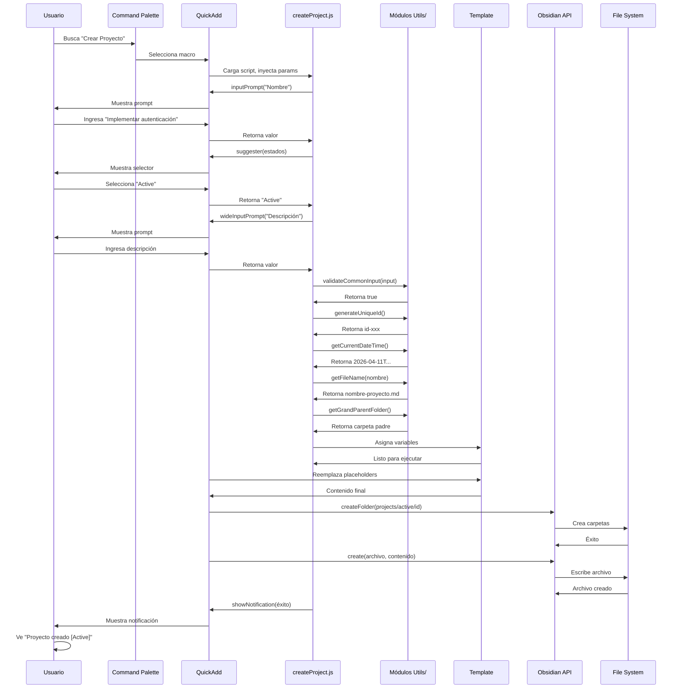
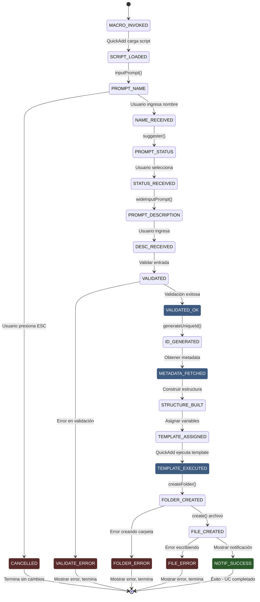

```yaml
type: Caso de Uso Formal
title: UC-003 - CREAR PROYECTO
version: 1.0.0
scope: ACTIVIDAD 1 - Sistema QuickAdd
date: 2026-04-11
language: Español Mexicano - Técnico Profesional
status: Especificación Completada
```

# UC-003: CREAR PROYECTO

## 1. IDENTIFICACIÓN

| Atributo | Valor |
|----------|-------|
| **ID** | UC-003 |
| **Nombre** | Crear Proyecto |
| **Versión** | 1.0.0 |
| **Estado** | Especificación Completada |
| **Responsable** | Especificador de Casos de Uso |
| **Fecha Creación** | 2026-04-11 |
| **Fecha Última Actualización** | 2026-04-11 |
| **Prioridad** | ALTA (Sprint 1) |
| **Complejidad** | MEDIA |
| **Operaciones Atómicas** | OP-001, OP-002, OP-003, OP-005, OP-006, OP-007, OP-008, OP-010, OP-011, OP-012, OP-013, OP-014, OP-015 |

---

## 2. DESCRIPCIÓN BREVE

El usuario invoca macro "Crear Proyecto" a través de command palette de Obsidian. El sistema QuickAdd carga el script createProject.js que solicita nombre del proyecto, estado (Active, Paused, Planning) y descripción. Valida entrada, genera ID único, obtiene fecha de creación, metadata y carpeta padre, construye estructura de carpetas por estado, asigna variables de template, ejecuta template project.md y crea archivo final en carpeta estructurada. El usuario recibe notificación de éxito con información del proyecto creado.

---

## 3. ACTORES INVOLUCRADOS

| Actor | Tipo | Rol | Responsabilidad |
|-------|------|-----|-----------------|
| **Usuario (Nestor)** | Humano | Primario | Invoca macro, proporciona nombre, estado, descripción |
| **QuickAdd Plugin** | Sistema Externo | Secundario | Ejecuta macro, gestiona flujo de scripts |
| **Obsidian Core** | Componente Externo | Secundario | API vault (crear carpetas, crear archivos) |
| **Módulo Utilities** | Componente Externo | Secundario | Genera IDs, obtiene metadata, valida datos |
| **Template project.md** | Artefacto | Consumidor | Recibe variables y genera contenido markdown |

---

## 4. PRECONDICIONES

### Precondiciones Técnicas

1. **Macro QuickAdd registrado**
   - Macro "Crear Proyecto" está registrada en QuickAdd
   - Script createProject.js existe en folder scripts/
   - Template project.md existe en folder templates/

2. **Obsidian activo**
   - Vault está abierto y accesible
   - Usuario tiene permisos de lectura/escritura en vault
   - Plugin QuickAdd está habilitado

3. **Recursos disponibles**
   - Suficiente espacio en disco para crear carpetas y archivos
   - Suficiente RAM para ejecutar macros QuickAdd

4. **Dependencias instaladas**
   - Plugin QuickAdd versión 1.0+
   - Obsidian versión 1.1+
   - Módulos utils/ instalados correctamente

### Precondiciones de Negocio

1. Usuario tiene intención de crear nuevo proyecto
2. Usuario está familiarizado con estados de proyecto (Active, Paused, Planning)
3. Proyecto es diferente de repositorio (ámbito más amplio)

---

## 5. FLUJO PRINCIPAL

### Descripción General

El usuario ejecuta macro que dispara proceso de 14 pasos que culmina en la creación de archivo project.md en estructura de carpetas por estado.

### Pasos Detallados

---

#### **Paso 1: Invocación de Macro**

**Actor**: Usuario

**Acción**: Usuario abre command palette (Ctrl+P / Cmd+P) en Obsidian y busca "Crear Proyecto"

**Componentes invocados**: Obsidian command palette, QuickAdd macro registry

**Resultado esperado**: Macro "Crear Proyecto" es encontrada y seleccionada

---

#### **Paso 2: Carga de Script**

**Actor**: QuickAdd Plugin

**Acción**: 
- QuickAdd detecta selección de macro
- Carga archivo createProject.js desde folder scripts/
- Inyecta parámetros: { app, quickAddApi, variables }
- Ejecuta función principal del script

**Componentes invocados**: QuickAdd script loader, JavaScript runtime

**Resultado esperado**: Script createProject.js en ejecución con contexto inyectado

---

#### **Paso 3: Obtener Nombre del Proyecto (OP-001)**

**Actor**: createProject.js + Usuario

**Acción**:
- Script llama quickAddApi.inputPrompt("Nombre del proyecto:")
- QuickAdd muestra prompt interactivo
- Usuario ingresa nombre (ej: "Implementar sistema de autenticación")
- Script recibe valor en variable _input_name

**Componentes invocados**: quickAddApi.inputPrompt(), UI prompts QuickAdd

**Resultado esperado**: _input_name contiene nombre ingresado por usuario

---

#### **Paso 4: Obtener Estado del Proyecto**

**Actor**: createProject.js + Usuario

**Acción**:
- Script llama quickAddApi.suggester(["Active", "Paused", "Planning"], ["Active", "Paused", "Planning"])
- QuickAdd muestra selector con 3 opciones
- Usuario selecciona uno (ej: "Active")
- Script recibe valor en variable _input_status

**Componentes invocados**: quickAddApi.suggester(), UI selector QuickAdd

**Resultado esperado**: _input_status contiene estado seleccionado ("Active", "Paused" o "Planning")

---

#### **Paso 5: Obtener Descripción del Proyecto**

**Actor**: createProject.js + Usuario

**Acción**:
- Script llama quickAddApi.wideInputPrompt("Descripción del proyecto:")
- QuickAdd muestra prompt multi-línea
- Usuario ingresa descripción (ej: "Sistema completo de autenticación con OAuth2 y 2FA")
- Script recibe valor en variable _input_description

**Componentes invocados**: quickAddApi.wideInputPrompt(), UI prompts QuickAdd

**Resultado esperado**: _input_description contiene descripción ingresada por usuario

---

#### **Paso 6: Validar Entrada (OP-002)**

**Actor**: createProject.js

**Acción**:
- Validar _input_name no esté vacío
- Validar _input_name >= 3 caracteres
- Validar _input_name <= 255 caracteres
- Validar _input_name contiene solo: letras, números, guiones, espacios
- Validar _input_status es uno de: "Active", "Paused", "Planning"
- Si cualquier validación falla → Lanzar excepción

**Componentes invocados**: validationOperations.validateCommonInput()

**Resultado esperado**: _valid_input es true, o excepción E-001 a E-005

---

#### **Paso 7: Generar ID Único (OP-003)**

**Actor**: createProject.js

**Acción**:
- Llama generateUniqueId() de módulo utils/
- Genera ID con formato: id-{timestamp}-{random-hex}
- Asigna a variable _project_id

**Componentes invocados**: generateUniqueId(), Web Crypto API

**Resultado esperado**: _project_id contiene string único (ej: "id-naq5a6-c9g5e4d3f2b0a6c7")

---

#### **Paso 8: Obtener Fecha de Creación (OP-005)**

**Actor**: createProject.js

**Acción**:
- Llama getCurrentDateTime() de módulo utils/
- Obtiene fecha/hora actual en formato ISO
- Asigna a variable _meta_created

**Componentes invocados**: getCurrentDateTime(), JavaScript Date API

**Resultado esperado**: _meta_created contiene timestamp ISO (ej: "2026-04-11T15:00:00.789Z")

---

#### **Paso 9: Obtener Nombre de Archivo (OP-006)**

**Actor**: createProject.js

**Acción**:
- Llama getFileName(_input_name) de módulo utils/
- Limpia caracteres especiales
- Limita a 200 caracteres
- Reemplaza espacios con guiones
- Añade extensión .md
- Asigna a variable _file_name

**Componentes invocados**: getFileName()

**Resultado esperado**: _file_name contiene nombre archivo válido (ej: "implementar-sistema-autenticacion.md")

---

#### **Paso 10: Obtener Metadata de Contexto (OP-007)**

**Actor**: createProject.js

**Acción**:
- Obtener autor actual (getAuthorName())
- Normalizar estado a minúsculas: "Active" → "active"
- Construir tags: [estado, "project"]
- Crear objeto _project_metadata con estructura completa

**Componentes invocados**: getAuthorName(), object construction

**Resultado esperado**: _project_metadata contiene metadatos de proyecto

---

#### **Paso 11: Obtener Carpeta Padre (OP-008)**

**Actor**: createProject.js

**Acción**:
- Llama getGrandParentFolder(currentFilePath) de módulo utils/
- Obtiene nombre de carpeta padre del archivo actual
- Asigna a variable _folder_parent

**Componentes invocados**: getGrandParentFolder()

**Resultado esperado**: _folder_parent contiene nombre carpeta (ej: "400-DIARIO")

---

#### **Paso 12: Construir Estructura de Carpetas (OP-010)**

**Actor**: createProject.js

**Acción**:
- Construir ruta de estructura: projects/{status}/{id}/
- Normalizar estado a minúsculas: "Active" → "active"
- Construir ruta completa: projects/active/{id}/
- Asignar a variable _folder_structure

**Componentes invocados**: String formatting, path construction

**Resultado esperado**: _folder_structure contiene ruta válida (ej: "projects/active/id-naq5a6-c9g5e4d3f2b0a6c7/")

---

#### **Paso 13: Procesar Información Específica (OP-011)**

**Actor**: createProject.js

**Acción**:
- Obtener autor actual
- Construir tags: [estado.toLowerCase(), "project"]
- Inicializar lista de tareas vacía: []
- Inicializar lista de hitos vacía: []
- Crear objeto _project_metadata con estructura completa:
  - id
  - name
  - status (normalizado)
  - created
  - author
  - tags
  - description
  - tasks (vacío)
  - milestones (vacío)

**Componentes invocados**: Object construction

**Resultado esperado**: _project_metadata contiene:
```javascript
{
  id: "id-naq5a6-c9g5e4d3f2b0a6c7",
  name: "Implementar sistema de autenticación",
  status: "active",
  created: "2026-04-11T15:00:00.789Z",
  author: "Nestor",
  tags: ["active", "project"],
  description: "Sistema completo de autenticación con OAuth2 y 2FA",
  tasks: [],
  milestones: []
}
```

---

#### **Paso 14: Asignar Variables de Template (OP-012)**

**Actor**: createProject.js

**Acción**:
- Asignar variables.projectId = _project_id
- Asignar variables.projectName = _input_name
- Asignar variables.projectStatus = _input_status
- Asignar variables.projectDescription = _input_description
- Asignar variables.folderPath = _folder_structure
- Asignar variables.fileName = _file_name
- Asignar variables.metadata = _project_metadata
- Asignar variables.createdDate = _meta_created

**Componentes invocados**: QuickAdd variables object

**Resultado esperado**: Objeto variables poblado con 8 variables para template

---

#### **Paso 15: Ejecutar Template (OP-013)**

**Actor**: QuickAdd Engine

**Acción**:
- QuickAdd carga template templates/project.md
- Reemplaza placeholders {{VARIABLE:...}} con valores de variables
- Genera contenido final markdown
- Prepara para creación de archivo

**Componentes invocados**: QuickAdd template engine

**Resultado esperado**: Contenido markdown final generado, sin placeholders sin reemplazar

**Ejemplo de contenido generado**:
```markdown
---
id: id-naq5a6-c9g5e4d3f2b0a6c7
name: Implementar sistema de autenticación
status: active
created: 2026-04-11T15:00:00.789Z
author: Nestor
tags:
  - active
  - project
---

# Implementar sistema de autenticación

**Estado:** Active  
**Creado:** 2026-04-11  
**Autor:** Nestor

## Descripción

Sistema completo de autenticación con OAuth2 y 2FA

## Tareas

- [ ] Diseñar arquitectura
- [ ] Implementar OAuth2
- [ ] Implementar 2FA
- [ ] Testing
- [ ] Documentación

## Hitos

- [ ] Fase 1: Diseño (2026-05-15)
- [ ] Fase 2: Desarrollo (2026-06-30)
- [ ] Fase 3: Testing (2026-07-15)

## Recursos

- Frontend: React
- Backend: Node.js + Express
- Database: PostgreSQL

## Notas

[Agregar notas del proyecto aquí]
```

---

#### **Paso 16: Crear Archivo en Vault (OP-014)**

**Actor**: Obsidian API

**Acción**:
- Obsidian crea carpeta: projects/active/id-naq5a6-c9g5e4d3f2b0a6c7/
- Obsidian crea archivo: implementar-sistema-autenticacion.md
- Obsidian escribe contenido generado
- Sistema operativo persiste en disco

**Componentes invocados**: app.vault.createFolder(), app.vault.create()

**Resultado esperado**: Archivo creado en ruta correcta con contenido completo

**Manejo de errores**:
- Carpeta no puede ser creada → Excepción E-006
- Archivo ya existe → Excepción E-007
- Permisos insuficientes → Excepción E-008
- Espacio en disco → Excepción E-009

---

#### **Paso 17: Mostrar Notificación de Éxito (OP-015)**

**Actor**: createProject.js

**Acción**:
- Llamar showNotification("Proyecto creado: Implementar sistema de autenticación [Active]", "success")
- QuickAdd muestra notificación visual
- Notificación desaparece después de 5 segundos

**Componentes invocados**: showNotification(), QuickAdd notices

**Resultado esperado**: Usuario ve notificación verde: "Éxito: Proyecto creado [Active]"

---

## 6. FLUJOS ALTERNATIVOS

---

### Flujo Alternativo A1: Usuario Cancela Durante Nombre

**Punto de Activación**: Paso 3 (prompt de nombre)

**Pasos**:
1. Usuario abre prompt de nombre
2. Usuario presiona ESC o cierra prompt sin ingresar valor
3. QuickAdd detiene ejecución
4. Sistema retorna a estado inicial sin cambios
5. Usuario no ve notificación

**Retorno a Flujo Principal**: No aplica, UC termina sin completar

**Resultado**: Ningún archivo creado, ningún cambio en vault

---

### Flujo Alternativo A2: Usuario Ingresa Nombre Inválido

**Punto de Activación**: Paso 6 (validación)

**Pasos**:
1. Usuario ingresa nombre con caracteres inválidos: "Sistema @ Autenticación!"
2. Validación en Paso 6 falla
3. Script captura excepción E-004
4. Script llama showNotification("Error: Caracteres inválidos", "error")
5. Macro termina sin crear archivo

**Retorno a Flujo Principal**: No retorna, UC falla

**Resultado**: Ningún archivo creado, usuario ve error

---

### Flujo Alternativo A3: Usuario Selecciona Estado Inválido

**Punto de Activación**: Paso 6 (validación de estado)

**Pasos**:
1. Sistema valida _input_status
2. Usuario de alguna forma selecciona valor no permitido
3. Validación falla
4. Script captura excepción E-005
5. Script llama showNotification("Error: Estado inválido", "error")

**Retorno a Flujo Principal**: No retorna

**Resultado**: Ningún archivo creado

---

### Flujo Alternativo A4: Carpeta de Proyecto Ya Existe

**Punto de Activación**: Paso 16 (crear carpeta)

**Pasos**:
1. Sistema intenta crear carpeta projects/active/id-naq5a6.../
2. Carpeta ya existe (proyecto duplicado)
3. Obsidian API lanza error
4. Script captura excepción E-006
5. Script llama showNotification("Error: La carpeta del proyecto ya existe", "error")

**Retorno a Flujo Principal**: No retorna

**Resultado**: Ningún archivo nuevo creado

---

## 7. POSTCONDICIONES

### Postcondiciones Técnicas

1. **Archivo creado**
   - Archivo implementar-sistema-autenticacion.md existe en projects/active/id-naq5a6.../
   - Contenido contiene frontmatter YAML válido
   - Contenido contiene headers markdown válidos
   - Archivo es accesible en Obsidian

2. **Metadatos almacenados**
   - Frontmatter contiene: id, name, status, created, author, tags
   - Valores correctos según entrada usuario
   - Fecha en formato ISO 8601
   - Status es uno de: active, paused, planning

3. **Estructura creada**
   - Carpeta projects/ existe
   - Carpeta projects/active/ (según estado) existe
   - Carpeta projects/active/id-naq5a6.../ existe
   - Ninguna otra carpeta fue creada

4. **Obsidian actualizado**
   - Archivo aparece en file explorer
   - Archivo es indexable por metadataCache
   - Backlinks funcionan correctamente

### Postcondiciones de Negocio

1. Proyecto está listo para ser ejecutado
2. Usuario puede abrir archivo y editar contenido
3. Usuario puede agregar tareas y hitos
4. Estructura facilita organización de proyecto

---

## 8. PUNTOS CRÍTICOS

### Punto Crítico PC1: Validación de Estado
**Ubicación**: Paso 6
**Riesgo**: Si estado no es uno de los 3 permitidos, estructura de carpetas será inconsistente
**Mitigación**: Usar lista VALID_STATUSES = ["Active", "Paused", "Planning"]

---

### Punto Crítico PC2: Normalización de Estado
**Ubicación**: Paso 12
**Riesgo**: Si estado no es normalizado a minúsculas, carpeta será "Active" en lugar de "active"
**Mitigación**: Siempre normalizar: _input_status.toLowerCase()

---

### Punto Crítico PC3: Generación de ID Único
**Ubicación**: Paso 7
**Riesgo**: Si ID no es único, proyectos se sobrescriben
**Mitigación**: Usar Web Crypto API, combinar timestamp + random hex

---

## 9. EXCEPCIONES

| Código | Condición | Mensaje | Acción |
|--------|-----------|---------|--------|
| **E-001** | Nombre vacío | "Error: Nombre no puede estar vacío" | Mostrar error, terminar macro |
| **E-002** | Nombre < 3 caracteres | "Error: Nombre mínimo 3 caracteres" | Mostrar error, terminar macro |
| **E-003** | Nombre > 255 caracteres | "Error: Nombre máximo 255 caracteres" | Mostrar error, terminar macro |
| **E-004** | Caracteres inválidos | "Error: Solo letras, números, guiones y espacios" | Mostrar error, terminar macro |
| **E-005** | Estado inválido | "Error: Estado debe ser Active, Paused o Planning" | Mostrar error, terminar macro |
| **E-006** | Carpeta no puede crearse | "Error: No se puede crear carpeta (permisos)" | Mostrar error, terminar macro |
| **E-007** | Archivo ya existe | "Error: El archivo ya existe" | Mostrar error, terminar macro |
| **E-008** | Permisos insuficientes | "Error: Permisos insuficientes en vault" | Mostrar error, terminar macro |
| **E-009** | Espacio en disco | "Error: Espacio en disco insuficiente" | Mostrar error, terminar macro |
| **E-010** | Template no encontrado | "Error: Template project.md no encontrado" | Mostrar error, terminar macro |

---

## 10. DIAGRAMAS

### Diagrama 1: Flujo de Secuencia



---

### Diagrama 2: Máquina de Estados



---

## 11. NOTAS DE IMPLEMENTACIÓN

### Librería y Dependencias

| Librería | Versión | Uso | Razón |
|----------|---------|-----|-------|
| **QuickAdd** | >= 1.0 | Macro engine | Estándar en Obsidian |
| **Obsidian API** | >= 1.1 | Vault access | Nativo en Obsidian |
| **Módulos Utils/** | Desarrollados | Validación, generación | Custom, controlados |

### Patrones de Diseño

1. **Factory Pattern**
   - Script es factory que coordina módulos

2. **Template Method**
   - Script orquesta pasos predefinidos

3. **Composition**
   - Funciones simples y composibles

### Testing Strategy

**UC-003 requiere tests para:**
- ✓ Usuario ingresa nombre válido → éxito
- ✓ Usuario selecciona estado Active → estructura projects/active/
- ✓ Usuario selecciona estado Paused → estructura projects/paused/
- ✓ Usuario selecciona estado Planning → estructura projects/planning/
- ✓ Usuario ingresa descripción → metadata correcta
- ✓ Archivo creado contiene YAML válido → parseable
- ✓ Template variables reemplazadas → sin placeholders literales
- ✓ Usuario cancela durante prompt → ningún cambio
- ✓ Carpeta estructura creada correctamente → verificar filesystem
- ✓ Caracteres inválidos → error E-004

---

## 12. TRAZABILIDAD

| Operación Atómica | Pasos UC | Código | Módulo |
|---|---|---|---|
| **OP-001** (Obtener entrada) | 3, 4, 5 | quickAddApi.inputPrompt/suggester | createProject.js |
| **OP-002** (Validar entrada) | 6 | validateCommonInput() | utils/validationOperations.js |
| **OP-003** (Gen ID único) | 7 | generateUniqueId() | utils/generateUniqueId.js |
| **OP-005** (Fecha actual) | 8 | getCurrentDateTime() | utils/getCurrentDateTime.js |
| **OP-006** (Nombre archivo) | 9 | getFileName() | utils/getFileName.js |
| **OP-007** (Obtener metadata) | 10 | getAuthorName() + tags | utils/getAuthorName.js |
| **OP-008** (Carpeta padre) | 11 | getGrandParentFolder() | utils/getGrandParentFolder.js |
| **OP-010** (Estructura carpetas) | 12 | Inline path construction | createProject.js |
| **OP-011** (Procesar específico) | 13 | Status mapping, metadata assembly | createProject.js |
| **OP-012** (Asignar variables) | 14 | variables.X = Y | createProject.js |
| **OP-013** (Ejecutar template) | 15 | quickAddApi template engine | QuickAdd |
| **OP-014** (Crear archivo) | 16 | app.vault.create() | Obsidian API |
| **OP-015** (Mostrar notificación) | 17 | showNotification() | utils/showNotification.js |

---

## 13. CRITERIOS DE ACEPTACIÓN

**UC-003 es COMPLETADO cuando:**

- [ ] Código implementado en createProject.js
- [ ] Todos 11+ tests PASAN
- [ ] Coverage de UC-003 > 90%
- [ ] Type hints 100% (máximo eslint errors: 0)
- [ ] Docstrings completos (JSDoc style)
- [ ] No warnings de linter
- [ ] Macro ejecutable desde command palette
- [ ] Flujos alternativos A1-A4 testeados
- [ ] Excepciones E-001 a E-010 manejadas
- [ ] Notificaciones visuales funcionan (incluyendo estado)
- [ ] Archivo creado contiene frontmatter válido con estado
- [ ] Carpeta estructura por estado creada correctamente
- [ ] Variables de template reemplazadas
- [ ] Descripción soporta múltiples líneas
- [ ] Documentación (este artefacto) completada
- [ ] Revisión técnica aprobada

---

## 14. REFERENCIAS

**Documentos relacionados:**
- PASO 1 V4 - Análisis de operaciones atómicas
- PASO2-INDEX - Índice de 5 UCs
- PASO2-UC-001-REPOSITORY - Patrón similar
- PASO2-UC-002-TASK - Patrón similar
- Convenciones-de-Código v1.0.0
- Convenciones-Pragmáticas v1.0.0
- Convenciones-JavaScript v2.0.0

**Especificaciones externas:**
- Obsidian API documentation: https://docs.obsidian.md/
- QuickAdd documentation: https://quickadd.obsidian.guide/

---

**Documento**: UC-003-CREAR-PROYECTO.md
**Versión**: 1.0.0
**Fecha**: 2026-04-11
**Estado**: ESPECIFICACIÓN COMPLETADA - LISTO PARA IMPLEMENTACIÓN
