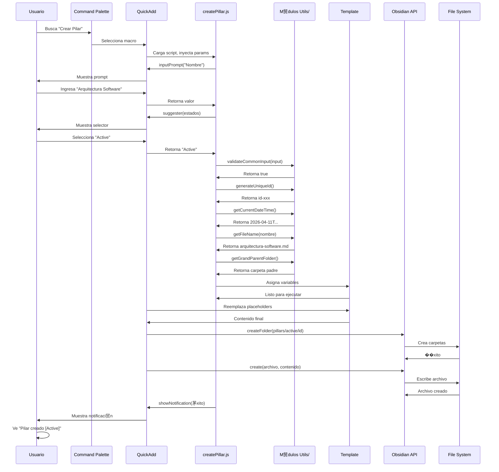
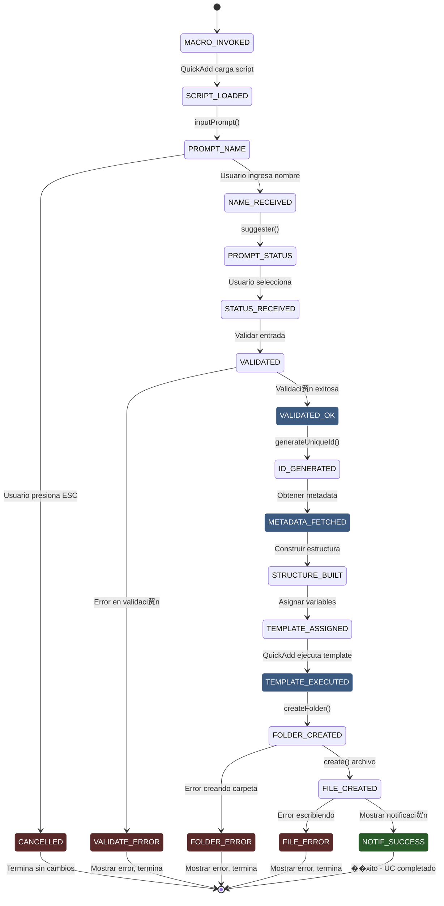

```yaml
type: Caso de Uso Formal
title: UC-004 - CREAR PILAR
version: 1.0.0
scope: ACTIVIDAD 1 - Sistema QuickAdd
date: 2026-04-11
language: Espa帽ol Mexicano - T茅cnico Profesional
status: Especificaci贸n Completada
```

# UC-004: CREAR PILAR

## 1. IDENTIFICACI�[SPEC]N

| Atributo | Valor |
|----------|-------|
| **ID** | UC-004 |
| **Nombre** | Crear Pilar |
| **Versi贸n** | 1.0.0 |
| **Estado** | Especificaci贸n Completada |
| **Responsable** | Especificador de Casos de Uso |
| **Fecha Creaci贸n** | 2026-04-11 |
| **Fecha �[REF]ltima Actualizaci贸n** | 2026-04-11 |
| **Prioridad** | MEDIA (Sprint 1-2) |
| **Complejidad** | MEDIA |
| **Operaciones At贸micas** | OP-001, OP-002, OP-005, OP-006, OP-008, OP-011, OP-012, OP-013, OP-014, OP-015 |

---

## 2. DESCRIPCI�[SPEC]N BREVE

El usuario invoca macro "Crear Pilar" a trav茅s de command palette de Obsidian. El sistema QuickAdd carga el script createPillar.js que solicita nombre del pilar y estado (Active, Inactive). Valida entrada, genera ID 煤nico, obtiene fecha de creaci贸n y carpeta padre, construye estructura de carpetas, asigna variables de template, ejecuta template pillar.md y crea archivo final. El usuario recibe notificaci贸n de 茅xito. Un pilar es un concepto o 谩rea tem谩tica fundamental que contiene notas relacionadas.

---

## 3. ACTORES INVOLUCRADOS

| Actor | Tipo | Rol | Responsabilidad |
|-------|------|-----|-----------------|
| **Usuario (Nestor)** | Humano | Primario | Invoca macro, proporciona nombre y estado del pilar |
| **QuickAdd Plugin** | Sistema Externo | Secundario | Ejecuta macro, gestiona flujo de scripts |
| **Obsidian Core** | Componente Externo | Secundario | API vault (crear carpetas, crear archivos) |
| **M贸dulo Utilities** | Componente Externo | Secundario | Genera IDs, obtiene metadata, valida datos |
| **Template pillar.md** | Artefacto | Consumidor | Recibe variables y genera contenido markdown |

---

## 4. PRECONDICIONES

### Precondiciones T茅cnicas

1. **Macro QuickAdd registrado**
   - Macro "Crear Pilar" est谩 registrada en QuickAdd
   - Script createPillar.js existe en folder scripts/
   - Template pillar.md existe en folder templates/

2. **Obsidian activo**
   - Vault est谩 abierto y accesible
   - Usuario tiene permisos de lectura/escritura en vault
   - Plugin QuickAdd est谩 habilitado

3. **Recursos disponibles**
   - Suficiente espacio en disco para crear carpetas y archivos
   - Suficiente RAM para ejecutar macros QuickAdd

4. **Dependencias instaladas**
   - Plugin QuickAdd versi贸n 1.0+
   - Obsidian versi贸n 1.1+
   - M贸dulos utils/ instalados correctamente

### Precondiciones de Negocio

1. Usuario tiene intenci贸n de crear nuevo pilar
2. Usuario est谩 familiarizado con concepto de pilares (谩reas tem谩ticas)
3. Pilar es diferente de proyecto (escala de concepto vs ejecuci贸n)

---

## 5. FLUJO PRINCIPAL

### Descripci贸n General

El usuario ejecuta macro que dispara proceso de 12 pasos que culmina en la creaci贸n de archivo pillar.md en estructura de carpetas por estado.

### Pasos Detallados

---

#### **Paso 1: Invocaci贸n de Macro**

**Actor**: Usuario

**Acci贸n**: Usuario abre command palette (Ctrl+P / Cmd+P) en Obsidian y busca "Crear Pilar"

**Componentes invocados**: Obsidian command palette, QuickAdd macro registry

**Resultado esperado**: Macro "Crear Pilar" es encontrada y seleccionada

---

#### **Paso 2: Carga de Script**

**Actor**: QuickAdd Plugin

**Acci贸n**: 
- QuickAdd detecta selecci贸n de macro
- Carga archivo createPillar.js desde folder scripts/
- Inyecta par谩metros: { app, quickAddApi, variables }
- Ejecuta funci贸n principal del script

**Componentes invocados**: QuickAdd script loader, JavaScript runtime

**Resultado esperado**: Script createPillar.js en ejecuci贸n con contexto inyectado

---

#### **Paso 3: Obtener Nombre del Pilar (OP-001)**

**Actor**: createPillar.js + Usuario

**Acci贸n**:
- Script llama quickAddApi.inputPrompt("Nombre del pilar:")
- QuickAdd muestra prompt interactivo
- Usuario ingresa nombre (ej: "Arquitectura de Software")
- Script recibe valor en variable _input_name

**Componentes invocados**: quickAddApi.inputPrompt(), UI prompts QuickAdd

**Resultado esperado**: _input_name contiene nombre ingresado por usuario

---

#### **Paso 4: Obtener Estado del Pilar**

**Actor**: createPillar.js + Usuario

**Acci贸n**:
- Script llama quickAddApi.suggester(["Active", "Inactive"], ["Active", "Inactive"])
- QuickAdd muestra selector con 2 opciones
- Usuario selecciona uno (ej: "Active")
- Script recibe valor en variable _input_status

**Componentes invocados**: quickAddApi.suggester(), UI selector QuickAdd

**Resultado esperado**: _input_status contiene estado seleccionado ("Active" o "Inactive")

---

#### **Paso 5: Validar Entrada (OP-002)**

**Actor**: createPillar.js

**Acci贸n**:
- Validar _input_name no est茅 vac铆o
- Validar _input_name >= 3 caracteres
- Validar _input_name <= 255 caracteres
- Validar _input_name contiene solo: letras, n煤meros, guiones, espacios
- Validar _input_status es uno de: "Active", "Inactive"
- Si cualquier validaci贸n falla Lanzar excepci贸n

**Componentes invocados**: validationOperations.validateCommonInput()

**Resultado esperado**: _valid_input es true, o excepci贸n E-001 a E-004

---

#### **Paso 6: Generar ID �[REF]nico (OP-003)**

**Actor**: createPillar.js

**Acci贸n**:
- Llama generateUniqueId() de m贸dulo utils/
- Genera ID con formato: id-{timestamp}-{random-hex}
- Asigna a variable _pillar_id

**Componentes invocados**: generateUniqueId(), Web Crypto API

**Resultado esperado**: _pillar_id contiene string 煤nico (ej: "id-naq5a7-d0h6f5e4g3c1b7d8")

---

#### **Paso 7: Obtener Fecha de Creaci贸n (OP-005)**

**Actor**: createPillar.js

**Acci贸n**:
- Llama getCurrentDateTime() de m贸dulo utils/
- Obtiene fecha/hora actual en formato ISO
- Asigna a variable _meta_created

**Componentes invocados**: getCurrentDateTime(), JavaScript Date API

**Resultado esperado**: _meta_created contiene timestamp ISO (ej: "2026-04-11T15:30:15.234Z")

---

#### **Paso 8: Obtener Nombre de Archivo (OP-006)**

**Actor**: createPillar.js

**Acci贸n**:
- Llama getFileName(_input_name) de m贸dulo utils/
- Limpia caracteres especiales
- Limita a 200 caracteres
- Reemplaza espacios con guiones
- A帽ade extensi贸n .md
- Asigna a variable _file_name

**Componentes invocados**: getFileName()

**Resultado esperado**: _file_name contiene nombre archivo v谩lido (ej: "arquitectura-software.md")

---

#### **Paso 9: Obtener Carpeta Padre (OP-008)**

**Actor**: createPillar.js

**Acci贸n**:
- Llama getGrandParentFolder(currentFilePath) de m贸dulo utils/
- Obtiene nombre de carpeta padre del archivo actual
- Asigna a variable _folder_parent

**Componentes invocados**: getGrandParentFolder()

**Resultado esperado**: _folder_parent contiene nombre carpeta (ej: "400-DIARIO")

---

#### **Paso 10: Procesar Informaci贸n Espec铆fica (OP-011)**

**Actor**: createPillar.js

**Acci贸n**:
- Obtener autor actual (getAuthorName())
- Normalizar estado a min煤sculas: "Active" "active"
- Construir tags: [estado, "pilar"]
- Crear objeto _pillar_metadata con estructura completa:
  - id
  - name
  - status (normalizado)
  - created
  - author
  - tags
  - relatedPillars (vac铆o)

**Componentes invocados**: getAuthorName(), object construction

**Resultado esperado**: _pillar_metadata contiene:
```javascript
{
  id: "id-naq5a7-d0h6f5e4g3c1b7d8",
  name: "Arquitectura de Software",
  status: "active",
  created: "2026-04-11T15:30:15.234Z",
  author: "Nestor",
  tags: ["active", "pilar"],
  relatedPillars: []
}
```

---

#### **Paso 11: Construir Estructura de Carpetas (OP-010)**

**Actor**: createPillar.js

**Acci贸n**:
- Construir ruta de estructura: pillars/{status}/{id}/
- Normalizar estado a min煤sculas: "Active" "active"
- Construir ruta completa: pillars/active/{id}/
- Asignar a variable _folder_structure

**Componentes invocados**: String formatting, path construction

**Resultado esperado**: _folder_structure contiene ruta v谩lida (ej: "pillars/active/id-naq5a7-d0h6f5e4g3c1b7d8/")

---

#### **Paso 12: Asignar Variables de Template (OP-012)**

**Actor**: createPillar.js

**Acci贸n**:
- Asignar variables.pillarId = _pillar_id
- Asignar variables.pillarName = _input_name
- Asignar variables.pillarStatus = _input_status
- Asignar variables.folderPath = _folder_structure
- Asignar variables.fileName = _file_name
- Asignar variables.metadata = _pillar_metadata
- Asignar variables.createdDate = _meta_created

**Componentes invocados**: QuickAdd variables object

**Resultado esperado**: Objeto variables poblado con 7 variables para template

---

#### **Paso 13: Ejecutar Template (OP-013)**

**Actor**: QuickAdd Engine

**Acci贸n**:
- QuickAdd carga template templates/pillar.md
- Reemplaza placeholders {{VARIABLE:...}} con valores de variables
- Genera contenido final markdown
- Prepara para creaci贸n de archivo

**Componentes invocados**: QuickAdd template engine

**Resultado esperado**: Contenido markdown final generado, sin placeholders sin reemplazar

**Ejemplo de contenido generado**:
```markdown
---
id: id-naq5a7-d0h6f5e4g3c1b7d8
name: Arquitectura de Software
status: active
created: 2026-04-11T15:30:15.234Z
author: Nestor
tags:
  - active
  - pilar
---

# Arquitectura de Software

**Estado:** Active  
**Creado:** 2026-04-11  
**Autor:** Nestor

## Descripci贸n

Conceptos, principios y patrones fundamentales de arquitectura de software

## �[DIR]reas Clave

- [ ] Dise帽o de sistemas
- [ ] Patrones arquitect贸nicos
- [ ] Microservicios
- [ ] SOLID Principles
- [ ] Clean Architecture

## Notas Relacionadas

[Enlaces a notas dentro de este pilar]

## Recursos

- Books
- Articles
- Courses
- Projects

## Referencias

[Agregar referencias externas aqu铆]
```

---

#### **Paso 14: Crear Archivo en Vault (OP-014)**

**Actor**: Obsidian API

**Acci贸n**:
- Obsidian crea carpeta: pillars/active/id-naq5a7-d0h6f5e4g3c1b7d8/
- Obsidian crea archivo: arquitectura-software.md
- Obsidian escribe contenido generado
- Sistema operativo persiste en disco

**Componentes invocados**: app.vault.createFolder(), app.vault.create()

**Resultado esperado**: Archivo creado en ruta correcta con contenido completo

**Manejo de errores**:
- Carpeta no puede ser creada Excepci贸n E-005
- Archivo ya existe Excepci贸n E-006
- Permisos insuficientes Excepci贸n E-007
- Espacio en disco Excepci贸n E-008

---

#### **Paso 15: Mostrar Notificaci贸n de ��xito (OP-015)**

**Actor**: createPillar.js

**Acci贸n**:
- Llamar showNotification("Pilar creado: Arquitectura de Software [Active]", "success")
- QuickAdd muestra notificaci贸n visual
- Notificaci贸n desaparece despu茅s de 5 segundos

**Componentes invocados**: showNotification(), QuickAdd notices

**Resultado esperado**: Usuario ve notificaci贸n verde: "��xito: Pilar creado [Active]"

---

## 6. FLUJOS ALTERNATIVOS

---

### Flujo Alternativo A1: Usuario Cancela Durante Nombre

**Punto de Activaci贸n**: Paso 3 (prompt de nombre)

**Pasos**:
1. Usuario abre prompt de nombre
2. Usuario presiona ESC o cierra prompt sin ingresar valor
3. QuickAdd detiene ejecuci贸n
4. Sistema retorna a estado inicial sin cambios
5. Usuario no ve notificaci贸n

**Retorno a Flujo Principal**: No aplica, UC termina sin completar

**Resultado**: Ning煤n archivo creado

---

### Flujo Alternativo A2: Usuario Ingresa Nombre Inv谩lido

**Punto de Activaci贸n**: Paso 5 (validaci贸n)

**Pasos**:
1. Usuario ingresa nombre con caracteres inv谩lidos: "Arquitectura @ Software!"
2. Validaci贸n en Paso 5 falla
3. Script captura excepci贸n E-003
4. Script llama showNotification("Error: Caracteres inv谩lidos", "error")
5. Macro termina sin crear archivo

**Retorno a Flujo Principal**: No retorna, UC falla

**Resultado**: Ning煤n archivo creado, usuario ve error

---

## 7. POSTCONDICIONES

### Postcondiciones T茅cnicas

1. **Archivo creado**
   - Archivo arquitectura-software.md existe en pillars/active/id-naq5a7.../
   - Contenido contiene frontmatter YAML v谩lido
   - Contenido contiene headers markdown v谩lidos
   - Archivo es accesible en Obsidian

2. **Metadatos almacenados**
   - Frontmatter contiene: id, name, status, created, author, tags
   - Valores correctos seg煤n entrada usuario
   - Fecha en formato ISO 8601
   - Status es uno de: active, inactive

3. **Estructura creada**
   - Carpeta pillars/ existe
   - Carpeta pillars/active/ (seg煤n estado) existe
   - Carpeta pillars/active/id-naq5a7.../ existe
   - Ninguna otra carpeta fue creada

4. **Obsidian actualizado**
   - Archivo aparece en file explorer
   - Archivo es indexable por metadataCache
   - Backlinks funcionan correctamente

### Postcondiciones de Negocio

1. Pilar est谩 listo para ser usado como concepto base
2. Usuario puede abrir archivo y editar contenido
3. Usuario puede crear notas de pilar dentro de este pilar
4. Pilar facilita organizaci贸n conceptual del vault

---

## 8. PUNTOS CR��TICOS

### Punto Cr铆tico PC1: Validaci贸n de Estado
**Ubicaci贸n**: Paso 5
**Riesgo**: Si estado no es uno de los 2 permitidos, estructura ser谩 inconsistente
**Mitigaci贸n**: Usar lista VALID_STATUSES = ["Active", "Inactive"]

---

### Punto Cr铆tico PC2: Normalizaci贸n de Estado
**Ubicaci贸n**: Paso 11
**Riesgo**: Si estado no es normalizado a min煤sculas, carpeta ser谩 "Active" en lugar de "active"
**Mitigaci贸n**: Siempre normalizar: _input_status.toLowerCase()

---

## 9. EXCEPCIONES

| C贸digo | Condici贸n | Mensaje | Acci贸n |
|--------|-----------|---------|--------|
| **E-001** | Nombre vac铆o | "Error: Nombre no puede estar vac铆o" | Mostrar error, terminar macro |
| **E-002** | Nombre < 3 caracteres | "Error: Nombre m铆nimo 3 caracteres" | Mostrar error, terminar macro |
| **E-003** | Caracteres inv谩lidos | "Error: Solo letras, n煤meros, guiones y espacios" | Mostrar error, terminar macro |
| **E-004** | Estado inv谩lido | "Error: Estado debe ser Active o Inactive" | Mostrar error, terminar macro |
| **E-005** | Carpeta no puede crearse | "Error: No se puede crear carpeta (permisos)" | Mostrar error, terminar macro |
| **E-006** | Archivo ya existe | "Error: El archivo ya existe" | Mostrar error, terminar macro |
| **E-007** | Permisos insuficientes | "Error: Permisos insuficientes en vault" | Mostrar error, terminar macro |
| **E-008** | Espacio en disco | "Error: Espacio en disco insuficiente" | Mostrar error, terminar macro |
| **E-009** | Template no encontrado | "Error: Template pillar.md no encontrado" | Mostrar error, terminar macro |

---

## 10. DIAGRAMAS

### Diagrama 1: Flujo de Secuencia



---

### Diagrama 2: M谩quina de Estados



---

## 11. NOTAS DE IMPLEMENTACI�[SPEC]N

### Librer铆a y Dependencias

| Librer铆a | Versi贸n | Uso | Raz贸n |
|----------|---------|-----|-------|
| **QuickAdd** | >= 1.0 | Macro engine | Est谩ndar en Obsidian |
| **Obsidian API** | >= 1.1 | Vault access | Nativo en Obsidian |
| **M贸dulos Utils/** | Desarrollados | Validaci贸n, generaci贸n | Custom, controlados |

### Testing Strategy

**UC-004 requiere tests para:**
- [DONE][DONE][SPEC] Usuario ingresa nombre v谩lido 茅xito
- [DONE][DONE][SPEC] Usuario selecciona estado Active estructura pillars/active/
- [DONE][DONE][SPEC] Usuario selecciona estado Inactive estructura pillars/inactive/
- [DONE][DONE][SPEC] Archivo creado contiene YAML v谩lido parseable
- [DONE][DONE][SPEC] Template variables reemplazadas sin placeholders literales
- [DONE][DONE][SPEC] Usuario cancela durante prompt ning煤n cambio
- [DONE][DONE][SPEC] Carpeta estructura creada correctamente verificar filesystem

---

## 12. TRAZABILIDAD

| Operaci贸n At贸mica | Pasos UC | C贸digo | M贸dulo |
|---|---|---|---|
| **OP-001** (Obtener entrada) | 3, 4 | quickAddApi.inputPrompt/suggester | createPillar.js |
| **OP-002** (Validar entrada) | 5 | validateCommonInput() | utils/validationOperations.js |
| **OP-003** (Gen ID 煤nico) | 6 | generateUniqueId() | utils/generateUniqueId.js |
| **OP-005** (Fecha actual) | 7 | getCurrentDateTime() | utils/getCurrentDateTime.js |
| **OP-006** (Nombre archivo) | 8 | getFileName() | utils/getFileName.js |
| **OP-008** (Carpeta padre) | 9 | getGrandParentFolder() | utils/getGrandParentFolder.js |
| **OP-010** (Estructura carpetas) | 11 | Inline path construction | createPillar.js |
| **OP-011** (Procesar espec铆fico) | 10 | Status mapping, metadata assembly | createPillar.js |
| **OP-012** (Asignar variables) | 12 | variables.X = Y | createPillar.js |
| **OP-013** (Ejecutar template) | 13 | quickAddApi template engine | QuickAdd |
| **OP-014** (Crear archivo) | 14 | app.vault.create() | Obsidian API |
| **OP-015** (Mostrar notificaci贸n) | 15 | showNotification() | utils/showNotification.js |

---

## 13. CRITERIOS DE ACEPTACI�[SPEC]N

**UC-004 es COMPLETADO cuando:**

- [ ] C贸digo implementado en createPillar.js
- [ ] Todos 9+ tests PASAN
- [ ] Coverage de UC-004 > 90%
- [ ] Type hints 100% (m谩ximo eslint errors: 0)
- [ ] Docstrings completos (JSDoc style)
- [ ] No warnings de linter
- [ ] Macro ejecutable desde command palette
- [ ] Flujos alternativos A1-A2 testeados
- [ ] Excepciones E-001 a E-009 manejadas
- [ ] Notificaciones visuales funcionan
- [ ] Archivo creado contiene frontmatter v谩lido
- [ ] Carpeta estructura por estado creada correctamente
- [ ] Variables de template reemplazadas
- [ ] Documentaci贸n (este artefacto) completada
- [ ] Revisi贸n t茅cnica aprobada

---

## 14. REFERENCIAS

**Documentos relacionados:**
- PASO 1 V4 - An谩lisis de operaciones at贸micas
- PASO2-INDEX - ��ndice de 5 UCs
- PASO2-UC-001-REPOSITORY - Patr贸n similar
- PASO2-UC-002-TASK - Patr贸n similar
- PASO2-UC-003-PROJECT - Patr贸n similar
- PASO2-UC-005-PILLAR-NOTE - Relacionado (UC-004 es requisito)
- Convenciones-de-C贸digo v1.0.0
- Convenciones-Pragm谩ticas v1.0.0
- Convenciones-JavaScript v2.0.0

**Especificaciones externas:**
- Obsidian API documentation: https://docs.obsidian.md/
- QuickAdd documentation: https://quickadd.obsidian.guide/

---

**Documento**: UC-004-CREAR-PILAR.md
**Versi贸n**: 1.0.0
**Fecha**: 2026-04-11
**Estado**: ESPECIFICACI�[SPEC]N COMPLETADA - LISTO PARA IMPLEMENTACI�[SPEC]N
