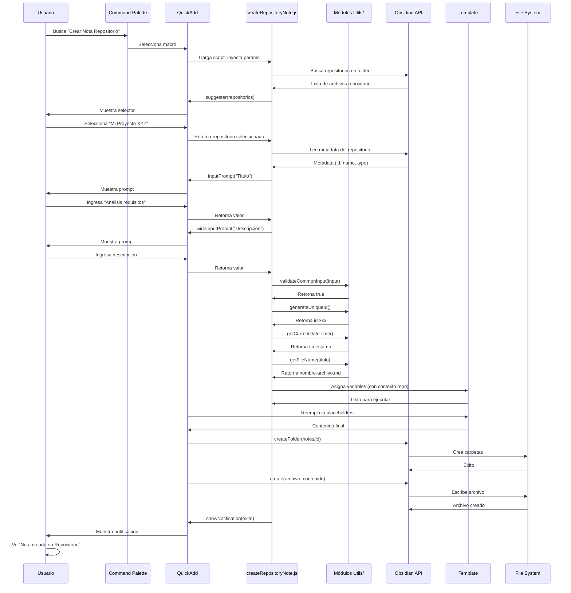
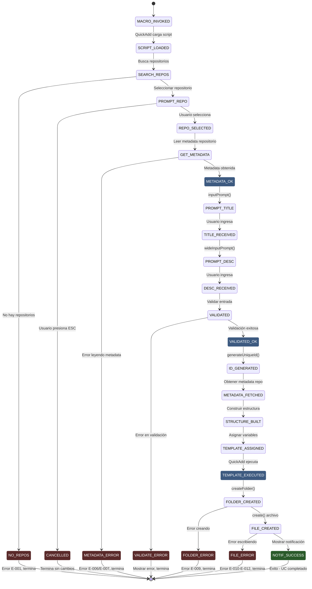

```yaml
type: Caso de Uso Formal
title: UC-005 - CREAR NOTA EN REPOSITORIO
version: 1.0.0
scope: ACTIVIDAD 1 - Sistema QuickAdd
date: 2026-04-11
language: Español Mexicano - Técnico Profesional
status: Especificación Completada
```

# UC-005: CREAR NOTA EN REPOSITORIO

## 1. IDENTIFICACIÓN

| Atributo | Valor |
|----------|-------|
| **ID** | UC-005 |
| **Nombre** | Crear Nota en Repositorio |
| **Versión** | 1.0.0 |
| **Estado** | Especificación Completada |
| **Responsable** | Especificador de Casos de Uso |
| **Fecha Creación** | 2026-04-11 |
| **Fecha Última Actualización** | 2026-04-11 |
| **Prioridad** | MEDIA (Sprint 2) |
| **Complejidad** | ALTA |
| **Precondición Especial** | UC-001 debe estar completado (repositorio debe existir) |
| **Operaciones Atómicas** | OP-001, OP-002, OP-003, OP-005, OP-007, OP-011, OP-012, OP-013, OP-014, OP-015 |

---

## 2. DESCRIPCIÓN BREVE

El usuario invoca macro "Crear Nota en Repositorio" a través de command palette de Obsidian. El sistema QuickAdd carga el script createRepositoryNote.js que solicita seleccionar repositorio existente, título de la nota y descripción. Obtiene metadata del repositorio padre (OP-007), valida entrada, genera ID único vinculado al repositorio, obtiene fecha de creación, construye estructura de carpetas dentro del repositorio, asigna variables incluyendo referencia cruzada, ejecuta template repositoryNote.md y crea archivo final. El usuario recibe notificación de éxito. Esta es una operación más compleja que depende de UC-001.

---

## 3. ACTORES INVOLUCRADOS

| Actor | Tipo | Rol | Responsabilidad |
|-------|------|-----|-----------------|
| **Usuario (Nestor)** | Humano | Primario | Invoca macro, selecciona repositorio, proporciona título y descripción |
| **QuickAdd Plugin** | Sistema Externo | Secundario | Ejecuta macro, gestiona flujo de scripts |
| **Obsidian Core** | Componente Externo | Secundario | API vault (acceso a archivos, crear carpetas/archivos) |
| **Módulo Utilities** | Componente Externo | Secundario | Genera IDs, obtiene metadata, valida datos |
| **MetadataCache** | Componente Obsidian | Auxiliar | Proporciona metadata de repositorio padre |
| **Template repositoryNote.md** | Artefacto | Consumidor | Recibe variables incluyendo contexto del repositorio |

---

## 4. PRECONDICIONES

### Precondiciones Técnicas

1. **Macro QuickAdd registrado**
   - Macro "Crear Nota en Repositorio" está registrada en QuickAdd
   - Script createRepositoryNote.js existe en folder scripts/
   - Template repositoryNote.md existe en folder templates/

2. **Repositorios existentes**
   - Al menos un repositorio existe en vault (resultado de UC-001)
   - Repositorios están en folder repositories/ con estructura válida
   - Archivos de repositorio contienen frontmatter YAML con id, name, type

3. **Obsidian activo**
   - Vault está abierto y accesible
   - Usuario tiene permisos de lectura/escritura en vault
   - Plugin QuickAdd está habilitado

4. **Dependencias instaladas**
   - Plugin QuickAdd versión 1.0+
   - Obsidian versión 1.1+
   - Módulos utils/ instalados correctamente

### Precondiciones de Negocio

1. Usuario tiene intención de crear nota dentro de repositorio existente
2. Usuario ha creado al menos un repositorio (UC-001 completado)
3. Nota es contenido específico dentro del contexto del repositorio
4. Referencia cruzada entre nota y repositorio es importante

---

## 5. FLUJO PRINCIPAL

### Descripción General

El usuario ejecuta macro que dispara proceso de 14 pasos que culmina en la creación de archivo nota.md dentro de carpeta del repositorio, con referencia cruzada al repositorio padre.

### Pasos Detallados

---

#### **Paso 1: Invocación de Macro**

**Actor**: Usuario

**Acción**: Usuario abre command palette (Ctrl+P / Cmd+P) en Obsidian y busca "Crear Nota en Repositorio"

**Componentes invocados**: Obsidian command palette, QuickAdd macro registry

**Resultado esperado**: Macro "Crear Nota en Repositorio" es encontrada y seleccionada

---

#### **Paso 2: Carga de Script**

**Actor**: QuickAdd Plugin

**Acción**: 
- QuickAdd detecta selección de macro
- Carga archivo createRepositoryNote.js desde folder scripts/
- Inyecta parámetros: { app, quickAddApi, variables }
- Ejecuta función principal del script

**Componentes invocados**: QuickAdd script loader, JavaScript runtime

**Resultado esperado**: Script createRepositoryNote.js en ejecución con contexto inyectado

---

#### **Paso 3: Seleccionar Repositorio (OP-007)**

**Actor**: createRepositoryNote.js + Usuario

**Acción**:
- Script busca todos los archivos en folder repositories/
- Script lee frontmatter de cada archivo para obtener nombre y ID
- Script construye lista de repositorios disponibles
- Script llama quickAddApi.suggester(listaRepositorios, listaRepositorios)
- QuickAdd muestra selector con repositorios
- Usuario selecciona uno (ej: "Mi Proyecto XYZ (Personal)")
- Script extrae ID del repositorio seleccionado

**Componentes invocados**: quickAddApi.suggester(), getMetadataByFrontmatter()

**Resultado esperado**: _selected_repository contiene ID del repositorio seleccionado (ej: "id-naq5a4-a7f3c2b1d0e9f4a5")

**Manejo de errores**:
- No hay repositorios disponibles → Excepción E-001
- Usuario cancela selector → Macro se interrumpe sin notificación
- Repositorio sin ID en frontmatter → Excepción E-002

---

#### **Paso 4: Obtener Título de la Nota (OP-001)**

**Actor**: createRepositoryNote.js + Usuario

**Acción**:
- Script llama quickAddApi.inputPrompt("Título de la nota:")
- QuickAdd muestra prompt interactivo
- Usuario ingresa título (ej: "Análisis de requisitos")
- Script recibe valor en variable _input_title

**Componentes invocados**: quickAddApi.inputPrompt(), UI prompts QuickAdd

**Resultado esperado**: _input_title contiene título ingresado por usuario

---

#### **Paso 5: Obtener Descripción de la Nota**

**Actor**: createRepositoryNote.js + Usuario

**Acción**:
- Script llama quickAddApi.wideInputPrompt("Descripción (opcional):")
- QuickAdd muestra prompt multi-línea
- Usuario ingresa descripción o deja vacío
- Script recibe valor en variable _input_description

**Componentes invocados**: quickAddApi.wideInputPrompt(), UI prompts QuickAdd

**Resultado esperado**: _input_description contiene descripción (puede ser string vacío)

---

#### **Paso 6: Validar Entrada (OP-002)**

**Actor**: createRepositoryNote.js

**Acción**:
- Validar _input_title no esté vacío
- Validar _input_title >= 3 caracteres
- Validar _input_title <= 255 caracteres
- Validar _input_title contiene solo: letras, números, guiones, espacios
- Validar repositorio seleccionado es válido (ID no vacío)
- Si cualquier validación falla → Lanzar excepción

**Componentes invocados**: validationOperations.validateCommonInput()

**Resultado esperado**: _valid_input es true, o excepción E-003 a E-005

---

#### **Paso 7: Generar ID Único para Nota (OP-003)**

**Actor**: createRepositoryNote.js

**Acción**:
- Llama generateUniqueId() de módulo utils/
- Genera ID con formato: id-{timestamp}-{random-hex}
- Asigna a variable _note_id

**Componentes invocados**: generateUniqueId(), Web Crypto API

**Resultado esperado**: _note_id contiene string único (ej: "id-naq5b8-e1i7g6f5h4d2c8e9")

---

#### **Paso 8: Obtener Fecha de Creación (OP-005)**

**Actor**: createRepositoryNote.js

**Acción**:
- Llama getCurrentDateTime() de módulo utils/
- Obtiene fecha/hora actual en formato ISO
- Asigna a variable _meta_created

**Componentes invocados**: getCurrentDateTime(), JavaScript Date API

**Resultado esperado**: _meta_created contiene timestamp ISO (ej: "2026-04-11T16:00:30.567Z")

---

#### **Paso 9: Obtener Metadata del Repositorio Padre (OP-007)**

**Actor**: createRepositoryNote.js

**Acción**:
- Script busca archivo del repositorio seleccionado
- Llama getMetadataByFrontmatter(app, repositoryPath)
- Extrae metadata: id, name, type del repositorio
- Crea objeto _repo_context con información del repositorio padre
- Asigna a variable _repo_context

**Componentes invocados**: getMetadataByFrontmatter(), metadataCache

**Resultado esperado**: _repo_context contiene:
```javascript
{
  id: "id-naq5a4-a7f3c2b1d0e9f4a5",
  name: "Mi Proyecto XYZ",
  type: "personal",
  path: "repositories/personal/id-naq5a4-a7f3c2b1d0e9f4a5"
}
```

**Manejo de errores**:
- Archivo de repositorio no encontrado → Excepción E-006
- Frontmatter inválido → Excepción E-007
- Repositorio sin ID en metadata → Excepción E-008

---

#### **Paso 10: Obtener Nombre de Archivo (OP-006)**

**Actor**: createRepositoryNote.js

**Acción**:
- Llama getFileName(_input_title) de módulo utils/
- Limpia caracteres especiales
- Limita a 200 caracteres
- Reemplaza espacios con guiones
- Añade extensión .md
- Asigna a variable _file_name

**Componentes invocados**: getFileName()

**Resultado esperado**: _file_name contiene nombre archivo válido (ej: "analisis-requisitos.md")

---

#### **Paso 11: Construir Estructura de Carpetas**

**Actor**: createRepositoryNote.js

**Acción**:
- Construir ruta: repositories/{repo-type}/{repo-id}/notes/{note-id}/
- Usar información de _repo_context para construir ruta completa
- Ejemplo: repositories/personal/id-naq5a4-a7f3c2b1d0e9f4a5/notes/id-naq5b8-e1i7g6f5h4d2c8e9/
- Asignar a variable _folder_structure

**Componentes invocados**: String formatting, path construction

**Resultado esperado**: _folder_structure contiene ruta válida dentro del repositorio

---

#### **Paso 12: Procesar Información Específica (OP-011)**

**Actor**: createRepositoryNote.js

**Acción**:
- Obtener autor actual (getAuthorName())
- Construir tags: ["note", repositoryType, "repositoryNote"]
- Crear objeto _note_metadata con estructura completa incluyendo referencia al repositorio:
  - id
  - title
  - created
  - author
  - tags
  - repositoryId (referencia cruzada)
  - repositoryName (referencia cruzada)

**Componentes invocados**: Object construction

**Resultado esperado**: _note_metadata contiene:
```javascript
{
  id: "id-naq5b8-e1i7g6f5h4d2c8e9",
  title: "Análisis de requisitos",
  created: "2026-04-11T16:00:30.567Z",
  author: "Nestor",
  tags: ["note", "personal", "repositoryNote"],
  repositoryId: "id-naq5a4-a7f3c2b1d0e9f4a5",
  repositoryName: "Mi Proyecto XYZ",
  description: "Análisis de requisitos del proyecto"
}
```

---

#### **Paso 13: Asignar Variables de Template (OP-012)**

**Actor**: createRepositoryNote.js

**Acción**:
- Asignar variables.noteId = _note_id
- Asignar variables.noteTitle = _input_title
- Asignar variables.noteDescription = _input_description
- Asignar variables.folderPath = _folder_structure
- Asignar variables.fileName = _file_name
- Asignar variables.metadata = _note_metadata
- Asignar variables.repositoryContext = _repo_context (para referencia cruzada)
- Asignar variables.createdDate = _meta_created

**Componentes invocados**: QuickAdd variables object

**Resultado esperado**: Objeto variables poblado con 8 variables para template

---

#### **Paso 14: Ejecutar Template (OP-013)**

**Actor**: QuickAdd Engine

**Acción**:
- QuickAdd carga template templates/repositoryNote.md
- Reemplaza placeholders {{VARIABLE:...}} con valores de variables
- Genera contenido final markdown con referencia al repositorio padre
- Prepara para creación de archivo

**Componentes invocados**: QuickAdd template engine

**Resultado esperado**: Contenido markdown final generado, sin placeholders sin reemplazar

**Ejemplo de contenido generado**:
```markdown
---
id: id-naq5b8-e1i7g6f5h4d2c8e9
title: Análisis de requisitos
created: 2026-04-11T16:00:30.567Z
author: Nestor
tags:
  - note
  - personal
  - repositoryNote
repositoryId: id-naq5a4-a7f3c2b1d0e9f4a5
repositoryName: Mi Proyecto XYZ
---

# Análisis de requisitos

**Repositorio:** [[Mi Proyecto XYZ]]  
**Creado:** 2026-04-11  
**Autor:** Nestor

## Descripción

Análisis de requisitos del proyecto

## Requisitos Funcionales

- [ ] Requisito 1
- [ ] Requisito 2
- [ ] Requisito 3

## Requisitos No Funcionales

- [ ] Performance
- [ ] Seguridad
- [ ] Escalabilidad

## Notas

[Agregar notas detalladas aquí]

## Referencias

- Vinculado a: [[Mi Proyecto XYZ]]
```

---

#### **Paso 15: Crear Archivo en Vault (OP-014)**

**Actor**: Obsidian API

**Acción**:
- Obsidian crea carpeta: repositories/personal/id-naq5a4-a7f3c2b1d0e9f4a5/notes/id-naq5b8-e1i7g6f5h4d2c8e9/
- Obsidian crea archivo: analisis-requisitos.md
- Obsidian escribe contenido generado
- Sistema operativo persiste en disco

**Componentes invocados**: app.vault.createFolder(), app.vault.create()

**Resultado esperado**: Archivo creado en ruta correcta dentro de repositorio con contenido completo

**Manejo de errores**:
- Carpeta no puede ser creada → Excepción E-009
- Archivo ya existe → Excepción E-010
- Permisos insuficientes → Excepción E-011
- Espacio en disco → Excepción E-012

---

#### **Paso 16: Mostrar Notificación de Éxito (OP-015)**

**Actor**: createRepositoryNote.js

**Acción**:
- Llamar showNotification("Nota creada en Repositorio: Análisis de requisitos", "success")
- QuickAdd muestra notificación visual
- Notificación desaparece después de 5 segundos

**Componentes invocados**: showNotification(), QuickAdd notices

**Resultado esperado**: Usuario ve notificación verde: "Éxito: Nota creada en Repositorio"

---

## 6. FLUJOS ALTERNATIVOS

---

### Flujo Alternativo A1: No Existen Repositorios

**Punto de Activación**: Paso 3 (seleccionar repositorio)

**Pasos**:
1. Script busca repositorios en folder repositories/
2. No encuentra ninguno (UC-001 no ha sido completado)
3. Script lanza excepción E-001
4. Script llama showNotification("Error: No hay repositorios disponibles. Crea uno primero (UC-001)", "error")
5. Macro termina

**Retorno a Flujo Principal**: No retorna

**Resultado**: Usuario dirigido a crear repositorio primero

---

### Flujo Alternativo A2: Usuario Cancela Selección de Repositorio

**Punto de Activación**: Paso 3 (selector repositorio)

**Pasos**:
1. Usuario abre selector de repositorios
2. Usuario presiona ESC o cierra sin seleccionar
3. QuickAdd detiene ejecución
4. Sistema retorna a estado inicial sin cambios

**Retorno a Flujo Principal**: No aplica, UC termina sin completar

**Resultado**: Ningún archivo creado

---

### Flujo Alternativo A3: Usuario Ingresa Título Inválido

**Punto de Activación**: Paso 6 (validación)

**Pasos**:
1. Usuario ingresa título con caracteres inválidos: "Análisis @ requisitos!"
2. Validación en Paso 6 falla
3. Script captura excepción E-005
4. Script llama showNotification("Error: Caracteres inválidos", "error")
5. Macro termina sin crear archivo

**Retorno a Flujo Principal**: No retorna, UC falla

**Resultado**: Ningún archivo creado

---

### Flujo Alternativo A4: Repositorio Padre Corrupto

**Punto de Activación**: Paso 9 (obtener metadata del repositorio)

**Pasos**:
1. Script intenta leer metadata del repositorio seleccionado
2. Frontmatter YAML es inválido o falta campo "id"
3. Script captura excepción E-007
4. Script llama showNotification("Error: Metadata del repositorio inválida", "error")
5. Macro termina

**Retorno a Flujo Principal**: No retorna

**Resultado**: Usuario debe revisar integridad del repositorio

---

## 7. POSTCONDICIONES

### Postcondiciones Técnicas

1. **Archivo creado**
   - Archivo analisis-requisitos.md existe en repositories/personal/id-naq5a4.../notes/id-naq5b8.../
   - Contenido contiene frontmatter YAML válido con referencia al repositorio
   - Contenido contiene headers markdown válidos
   - Archivo es accesible en Obsidian

2. **Metadatos almacenados**
   - Frontmatter contiene: id, title, created, author, tags, repositoryId, repositoryName
   - Valores correctos según entrada usuario
   - Referencia cruzada al repositorio padre documentada
   - Fecha en formato ISO 8601

3. **Estructura creada**
   - Carpeta notes/ creada dentro del repositorio
   - Carpeta notes/id-naq5b8.../ creada para la nota
   - Ninguna otra carpeta fue creada fuera del repositorio

4. **Referencia Cruzada**
   - Nota contiene link wikilink al repositorio padre: [[Mi Proyecto XYZ]]
   - Obsidian establece relación bidireccional automáticamente

5. **Obsidian actualizado**
   - Archivo aparece en file explorer dentro del repositorio
   - Archivo es indexable por metadataCache
   - Backlinks funcionan correctamente

### Postcondiciones de Negocio

1. Nota está lista para ser documentada dentro del repositorio
2. Usuario puede abrir archivo y editar contenido
3. Relación con repositorio padre es explícita y documentada
4. Estructura jerárquica (repositorio → nota) es clara

---

## 8. PUNTOS CRÍTICOS

### Punto Crítico PC1: Selección de Repositorio
**Ubicación**: Paso 3
**Riesgo**: Si no hay repositorios, usuario vuelve a ver error sin instrucción clara
**Mitigación**: Mensaje de error clara indicar que debe crear repositorio primero

---

### Punto Crítico PC2: Referencia Cruzada al Repositorio
**Ubicación**: Paso 9 y 14
**Riesgo**: Si metadata del repositorio es inválida, nota crea referencia rota
**Mitigación**: Validar que repositorio tiene ID válido antes de crear nota

---

### Punto Crítico PC3: Estructura Jerárquica
**Ubicación**: Paso 11
**Riesgo**: Si carpeta notes/ no se crea, nota quedará fuera de estructura
**Mitigación**: Crear carpeta notes/ recursivamente dentro del repositorio

---

## 9. EXCEPCIONES

| Código | Condición | Mensaje | Acción |
|--------|-----------|---------|--------|
| **E-001** | No hay repositorios | "Error: No hay repositorios. Crea uno primero (UC-001)" | Mostrar error, terminar macro |
| **E-002** | Repositorio sin ID | "Error: Repositorio seleccionado tiene metadata inválida" | Mostrar error, terminar macro |
| **E-003** | Título vacío | "Error: Título no puede estar vacío" | Mostrar error, terminar macro |
| **E-004** | Título < 3 caracteres | "Error: Título mínimo 3 caracteres" | Mostrar error, terminar macro |
| **E-005** | Caracteres inválidos | "Error: Solo letras, números, guiones y espacios" | Mostrar error, terminar macro |
| **E-006** | Archivo repositorio no encontrado | "Error: Archivo del repositorio no encontrado" | Mostrar error, terminar macro |
| **E-007** | Frontmatter inválido | "Error: Metadata del repositorio inválida" | Mostrar error, terminar macro |
| **E-008** | Repositorio sin ID en metadata | "Error: Repositorio no tiene ID asignado" | Mostrar error, terminar macro |
| **E-009** | Carpeta no puede crearse | "Error: No se puede crear carpeta (permisos)" | Mostrar error, terminar macro |
| **E-010** | Archivo ya existe | "Error: El archivo ya existe" | Mostrar error, terminar macro |
| **E-011** | Permisos insuficientes | "Error: Permisos insuficientes en vault" | Mostrar error, terminar macro |
| **E-012** | Espacio en disco | "Error: Espacio en disco insuficiente" | Mostrar error, terminar macro |

---

## 10. DIAGRAMAS

### Diagrama 1: Flujo de Secuencia



---

### Diagrama 2: Máquina de Estados



---

## 11. NOTAS DE IMPLEMENTACIÓN

### Librería y Dependencias

| Librería | Versión | Uso | Razón |
|----------|---------|-----|-------|
| **QuickAdd** | >= 1.0 | Macro engine | Estándar en Obsidian |
| **Obsidian API** | >= 1.1 | Vault access | Nativo en Obsidian |
| **Módulos Utils/** | Desarrollados | Validación, generación | Custom, controlados |

### Patrones de Diseño

1. **Factory Pattern**
   - Script es factory que coordina búsqueda de repositorios y creación

2. **Template Method**
   - Script orquesta pasos predefinidos

3. **Composition**
   - Funciones simples y composibles
   - getMetadataByFrontmatter + construcción de estructura

### Testing Strategy

**UC-005 requiere tests para:**
- ✓ Usuario selecciona repositorio válido → éxito
- ✓ No hay repositorios disponibles → error E-001
- ✓ Usuario cancela selector → ningún cambio
- ✓ Título inválido → error
- ✓ Metadata repositorio se obtiene correctamente
- ✓ Nota creada dentro del repositorio → estructura jerárquica
- ✓ Referencia cruzada al repositorio → wikilink funciona
- ✓ Template variables reemplazadas → sin placeholders
- ✓ Archivo creado en folder notes/ del repositorio

---

## 12. TRAZABILIDAD

| Operación Atómica | Pasos UC | Código | Módulo |
|---|---|---|---|
| **OP-001** (Obtener entrada) | 4, 5 | quickAddApi.inputPrompt/wideInputPrompt | createRepositoryNote.js |
| **OP-002** (Validar entrada) | 6 | validateCommonInput() | utils/validationOperations.js |
| **OP-003** (Gen ID único) | 7 | generateUniqueId() | utils/generateUniqueId.js |
| **OP-005** (Fecha actual) | 8 | getCurrentDateTime() | utils/getCurrentDateTime.js |
| **OP-006** (Nombre archivo) | 10 | getFileName() | utils/getFileName.js |
| **OP-007** (Obtener metadata) | 3, 9 | getMetadataByFrontmatter() | utils/getMetadataByFrontmatter.js |
| **OP-010** (Estructura carpetas) | 11 | Inline path construction | createRepositoryNote.js |
| **OP-011** (Procesar específico) | 12 | Contexto repositorio, tags | createRepositoryNote.js |
| **OP-012** (Asignar variables) | 13 | variables.X = Y | createRepositoryNote.js |
| **OP-013** (Ejecutar template) | 14 | quickAddApi template engine | QuickAdd |
| **OP-014** (Crear archivo) | 15 | app.vault.create() | Obsidian API |
| **OP-015** (Mostrar notificación) | 16 | showNotification() | utils/showNotification.js |

---

## 13. CRITERIOS DE ACEPTACIÓN

**UC-005 es COMPLETADO cuando:**

- [ ] Código implementado en createRepositoryNote.js
- [ ] Todos 12+ tests PASAN
- [ ] Coverage de UC-005 > 90%
- [ ] Type hints 100% (máximo eslint errors: 0)
- [ ] Docstrings completos (JSDoc style)
- [ ] No warnings de linter
- [ ] Macro ejecutable desde command palette
- [ ] Flujos alternativos A1-A4 testeados
- [ ] Excepciones E-001 a E-012 manejadas
- [ ] Selector de repositorios funciona (muestra solo repos existentes)
- [ ] Notificaciones visuales funcionan
- [ ] Archivo creado en carpeta notes/ del repositorio
- [ ] Referencia cruzada al repositorio funciona (wikilink)
- [ ] Variables de template incluyen contexto del repositorio
- [ ] Precondición UC-001 validada (error claro si no existen repos)
- [ ] Documentación (este artefacto) completada
- [ ] Revisión técnica aprobada

---

## 14. REFERENCIAS

**Documentos relacionados:**
- PASO 1 V4 - Análisis de operaciones atómicas
- PASO2-INDEX - Índice de 5 UCs
- PASO2-UC-001-REPOSITORY - Precondición (debe existir repositorio)
- PASO2-UC-002-TASK - Patrón similar
- PASO2-UC-003-PROJECT - Patrón similar
- PASO2-UC-004-PILLAR - Patrón similar
- Convenciones-de-Código v1.0.0
- Convenciones-Pragmáticas v1.0.0
- Convenciones-JavaScript v2.0.0

**Especificaciones externas:**
- Obsidian API documentation: https://docs.obsidian.md/
- QuickAdd documentation: https://quickadd.obsidian.guide/

---

**Documento**: UC-005-CREAR-NOTA-REPOSITORIO.md
**Versión**: 1.0.0
**Fecha**: 2026-04-11
**Estado**: ESPECIFICACIÓN COMPLETADA - LISTO PARA IMPLEMENTACIÓN
